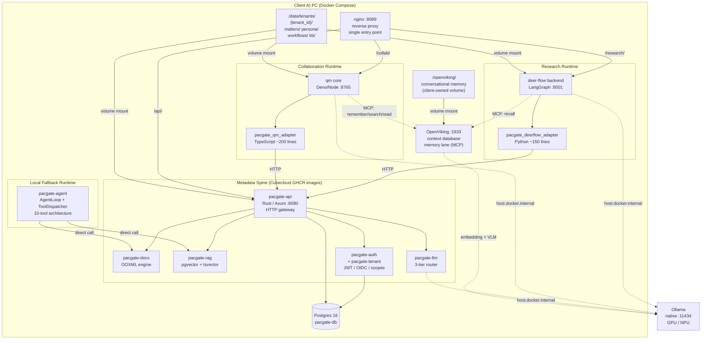
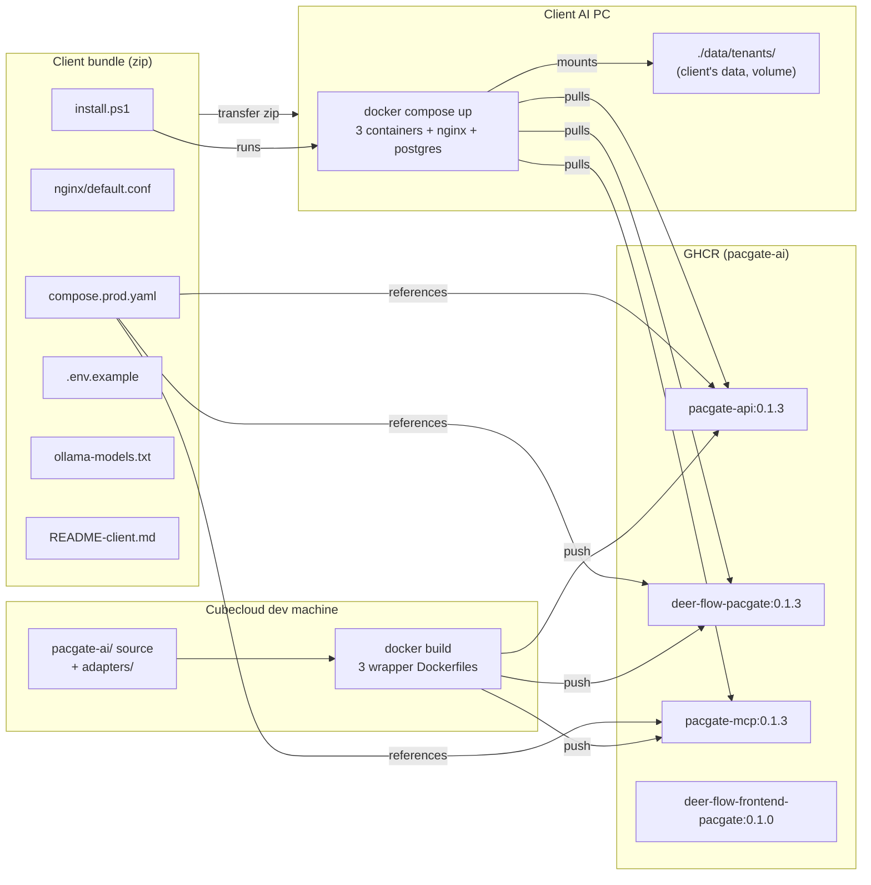
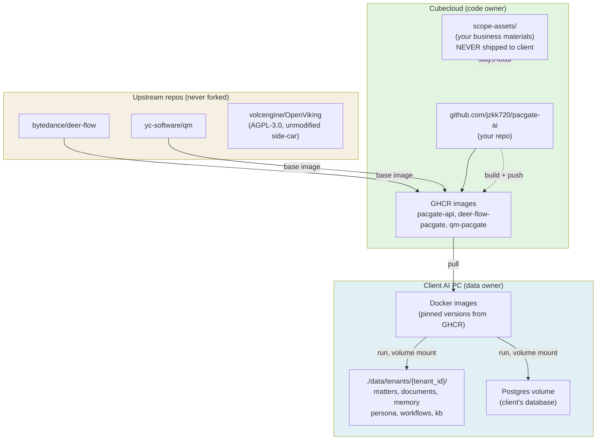
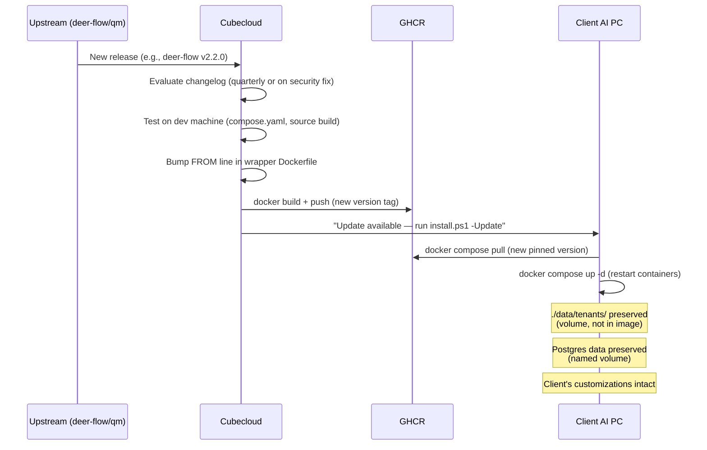
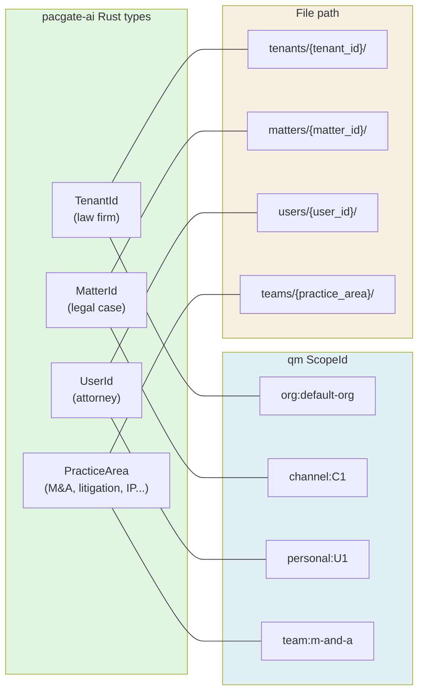

# Pacgate-ai Architecture Diagram

> Render this file in any Markdown viewer that supports Mermaid (GitHub, VS Code, Obsidian)
> Or paste the mermaid block into https://mermaid.live for a PNG/SVG export

## System overview

## Deployment flow

## Ownership and data boundaries

## Update lifecycle

## Scope model mapping

