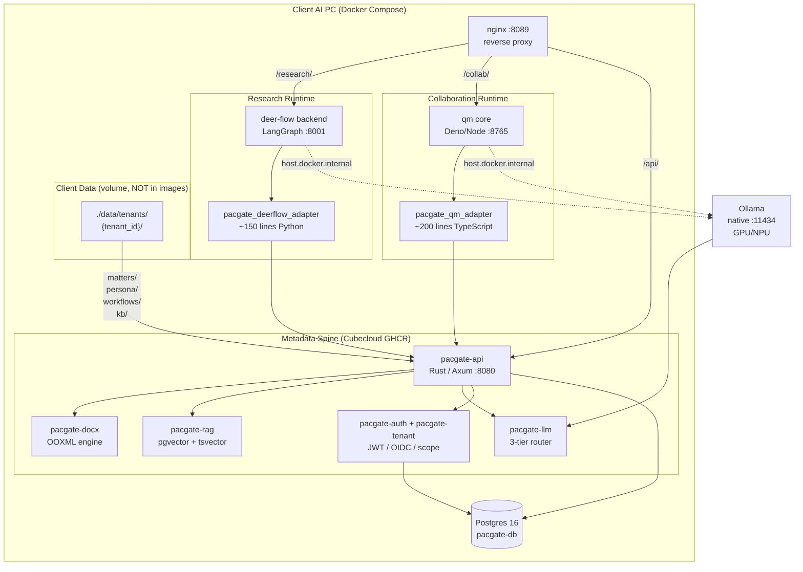

# Pacgate-ai Architecture & Deployment Plans

> Memo: dated 2026-08-12 — Cubecloud Limited / 智方云
> Status: Phase 1 pilot design, approved direction

## 1. Executive summary

Pacgate-ai is a privacy-first, local-first legal AI platform for attorney offices. The architecture uses **two upstream open-source runtimes** (deer-flow for research, qm for collaboration) behind a **Rust-owned metadata spine** (pacgate-ai crates), deployed to client AI PCs via Docker Compose with pre-built GHCR images.

The core design principle: **Cubecloud owns the code (images); the client owns the data (volume).** Neither deer-flow nor qm is forked — thin adapter packages translate between their native storage interfaces and pacgate-api's HTTP endpoints.

## 2. Architecture overview



## 3. The three layers

### 3.1 Metadata spine (pacgate-ai Rust crates)

The canonical source of truth. Headless HTTP server, no user-facing UI. Owns:

| Crate              | Responsibility                                                                                               | Status                                                                        |
| ------------------ | ------------------------------------------------------------------------------------------------------------ | ----------------------------------------------------------------------------- |
| `pacgate-core`     | Shared types: `TenantId`, `MatterId`, `DocumentId`, `Jurisdiction`, `PracticeArea`, `LlmTier`, `CitationRef` | ✅ Implemented                                                                |
| `pacgate-docx`     | OOXML builder, styles, tracked changes, diff                                                                 | ✅ `src/` exists (builder, styles, ooxml, diff)                               |
| `pacgate-api`      | Axum HTTP gateway: auth, matters, documents, chat, workflows, search routes                                  | ✅ Implemented for the current headless slice; tabular review remains stubbed |
| `pacgate-agent`    | Local fallback runtime: `AgentLoop` + `ToolDispatcher`, 10-tool architecture                                 | ✅ `src/` exists                                                              |
| `pacgate-llm`      | Three-tier model router (Main/Mid/Low), provider abstraction (Ollama, Anthropic, OpenAI, Qwen, DeepSeek)     | ✅ Skeleton exists                                                            |
| `pacgate-rag`      | Per-tenant retrieval: pgvector + tsvector                                                                    | Needs implementation                                                          |
| `pacgate-tenant`   | Tenant model, scope isolation, per-tenant config                                                             | Cargo.toml only                                                               |
| `pacgate-auth`     | JWT, OIDC, argon2, per-tenant identity                                                                       | Cargo.toml only                                                               |
| `pacgate-persona`  | 20 legal personas, firm-custom                                                                               | Cargo.toml only                                                               |
| `pacgate-workflow` | 160+ workflow templates (Suzie Law seed, MIT)                                                                | Cargo.toml only                                                               |
| `pacgate-search`   | Legal search                                                                                                 | Cargo.toml only                                                               |
| `pacgate-template` | Document templates                                                                                           | Cargo.toml only                                                               |
| WASM crates        | `pacgate-citation-check`, `pacgate-clause-parser`, `pacgate-doc-validator`, `pacgate-rule-engine`            | Cargo.toml only                                                               |

### 3.2 Research runtime (deer-flow)

- Upstream: `bytedance/deer-flow` (MIT, 19k+ stars)
- Purpose: multi-step legal research with citation extraction, source cross-checking, structured output
- Pipeline: Coordinator → Planner → {Researcher, Coder} → Reporter
- Legal skills shipped: `deep-research`, `systematic-literature-review`, `academic-paper-review`, `consulting-analysis`, `github-deep-research`
- Integration: Python adapter package + Pacgate matter-memory/document APIs. Current DeerFlow config should opt in via `memory.manager_class: deermem` and `memory.backend_config.storage_class: pacgate_deerflow_adapter.storage:PacgateMemoryStorage`
- **Never forked.** Wrapper image: `FROM ghcr.io/bytedance/deer-flow-backend:<ver>` + adapter pip package

### 3.3 Collaboration runtime (qm)

- Upstream: `yc-software/qm`
- Purpose: multi-tenant collaboration, approval flows, scope isolation, ethical walls
- Scope model: `org` (tenant) → `channel` (matter) → `personal` (attorney) → `team` (practice group)
- Features: per-scope security posture (ethical walls), per-scope egress policy, ACL grants, audit log
- Integration target: upstream qm exposes override seams (`buildApp(config, overrides)` per current planning assumptions), but this repo currently ships a tested TypeScript helper package and first-class `matters.external_key` binding only; the actual wrapper image is still pending
- **Never forked.** Wrapper image: `FROM ghcr.io/yc-software/qm/core:<ver>` + adapter Deno module

## 4. Why deer-flow + qm (not one or the other)

| Requirement                             | deer-flow        | qm                           | Verdict        |
| --------------------------------------- | ---------------- | ---------------------------- | -------------- |
| Deep research pipeline                  | ✅ First-class   | ❌ Generic loop              | deer-flow wins |
| Legal skills (lit review, paper review) | ✅ Shipped       | ❌ None                      | deer-flow wins |
| Multi-tenant scope model                | ❌ Flat users    | ✅ org/channel/team/personal | qm wins        |
| Ethical walls / conflict checking       | ❌ No scope      | ✅ Per-scope strict posture  | qm wins        |
| Per-tenant model config                 | ❌ No tenant     | ✅ Per-scope baseModel       | qm wins        |
| Audit trail                             | Partial          | ✅ Per-scope, per-principal  | qm wins        |
| Already integrated                      | ✅ Prior commits | ❌ No                        | deer-flow wins |

**Decision:** Phase deer-flow first (research capability gap), phase qm second (collaboration distribution). Keep both surfaces upstream-clean. The Rust metadata spine is the integration boundary.

## 5. Deployment model

### 5.1 Two-machine pilot (target topology, not the current root compose file)

| Machine 1 (inference + metadata) | Machine 2 (runtimes)           |
| -------------------------------- | ------------------------------ |
| Ollama (GPU/NPU, native)         | deer-flow backend              |
| pacgate-api (Rust)               | qm core                        |
| Postgres                         | nginx (entry point)            |
| `./data/tenants/` volume         | connects to machine 1 over LAN |

Attorneys hit machine 2's nginx → routes to deer-flow (`/research/`), qm (`/collab/`), or pacgate-api (`/api/`). Machine 2 proxies storage/auth calls to machine 1.

Current repo reality: the checked-in workspace-level `compose.yaml` and `nginx/default.conf` are a docs/auth-gate stack only. The runtime topology above remains the intended deployment target until the client bundle and qm wrapper are checked in.

### 5.2 GHCR images (3, all Cubecloud-owned)

| Image                                     | Base                                        | Contents                                | Rebuild cadence                         |
| ----------------------------------------- | ------------------------------------------- | --------------------------------------- | --------------------------------------- |
| `ghcr.io/jzkk720/pacgate-api:0.1.2`       | `rust:1.81` \u2192 `debian:slim`                 | Rust binary                             | When you ship a new version             |
| `ghcr.io/jzkk720/deer-flow-pacgate:0.1.0` | `ghcr.io/bytedance/deer-flow-backend:2.1.0` | deer-flow + Python adapter (~150 lines) | Quarterly or when deer-flow ships value |
| `ghcr.io/jzkk720/qm-pacgate:0.1.0`        | `ghcr.io/yc-software/qm/core:latest`        | qm core + TS adapter (~200 lines)       | Quarterly or when qm ships value        |

**Upstream repos are never forked.** Wrapper Dockerfiles `FROM` their published images and layer adapters on top. Upgrades = bump one `FROM` line + rebuild.

### 5.3 Client bundle

```
pacgate-client-bundle-v0.1.0.zip
├── compose.prod.yaml          ← pulls pre-built images, pinned versions
├── nginx/default.conf         ← single-port routing for all surfaces
├── .env.example               ← client fills passwords, tenant ID
├── install.ps1                ← one-click Windows installer
├── ollama-models.txt          ← models to pre-pull
└── README-client.md           ← setup instructions
```

No source code ships. No build toolchain needed. Client prerequisites: Docker Desktop + Ollama only.

## 6. File allocation

### 6.1 What lives in images (Cubecloud's code)

- pacgate-api Rust binary
- deer-flow runtime + adapter
- qm core + adapter
- nginx config

### 6.2 What lives on client disk (client's data)

```
./data/tenants/{tenant_id}/
├── matters/{matter_id}/
│   ├── docs/{name}_v{n}.docx      ← versioned documents (pacgate-docx)
│   ├── uploads/                     ← attorney-uploaded sources
│   ├── memory/facts.jsonl           ← extracted facts (pacgate-rag)
│   └── runs/{run_id}/               ← execution history
├── persona/*.yaml                   ← firm-custom personas
├── workflows/*.yaml                 ← 160+ templates
├── kb/                             ← firm-wide precedent, clause library
└── config.yaml                      ← per-tenant model_overrides
```

### 6.3 What stays on Cubecloud's dev machine (never shipped)

- `scope-assets/` — contract drafts, proposals, competitor research
- `pacgate-ai/` source — Rust crates
- `pacgate-adapters/` — Python + TypeScript adapters
- `compose.yaml` — dev compose (source builds)

## 7. Maintenance split

| Task                                           | Owner                            | Cadence                      |
| ---------------------------------------------- | -------------------------------- | ---------------------------- |
| pacgate-api code (bugs, endpoints, migrations) | Cubecloud                        | As needed                    |
| deer-flow wrapper (adapter, upstream bumps)    | Cubecloud                        | Quarterly                    |
| qm wrapper (adapter, upstream bumps)           | Cubecloud                        | Quarterly                    |
| Ollama model recommendations                   | Cubecloud advises                | When better models available |
| Schema migrations                              | Cubecloud (auto-run on startup)  | When types change            |
| Client's matters & documents                   | Client                           | Daily                        |
| Client's custom templates & personas           | Client (or Cubecloud consulting) | As needed                    |
| Hardware (GPU, disk, network)                  | Client IT                        | As needed                    |
| Docker Desktop / Ollama updates                | Client IT                        | OS-level                     |

**Client's only maintenance action:** run `install.ps1 --update` when Cubecloud says to.

## 8. Phasing

### Phase 1 (current): Research capability

- Finish deer-flow integration with pacgate-ai crates
- Implement `pacgate-tenant`, `pacgate-auth` (Cargo.toml exists, `src/` missing)
- Wire `pacgate-api` routes to storage (currently "not yet wired")
- Implement `pacgate-rag` (pgvector + tsvector)
- Build pacgate-api Dockerfile
- Write deer-flow Python adapter
- Deploy to first client AI PC
- Deliverable: cited legal research reports as DOCX

### Phase 2: Collaboration distribution

- Clone qm repo (clean, never patched)
- Write qm TypeScript adapter
- Map qm `ScopeId` ↔ pacgate-ai `TenantId`/`MatterId`/`UserId`
- Implement ethical walls (per-scope strict posture)
- Build qm wrapper Dockerfile
- Deploy to client AI PC alongside deer-flow
- Deliverable: attorneys share documents, approve workflows, distribute to team

### Phase 3 (deferred): SaaS / multi-client

- Split pacgate-api + Postgres onto dedicated node
- deer-flow + qm as stateless replicated services
- `./data/tenants/` → S3 or network filesystem
- Per-client billing, usage tracking
- This is the "deferred SaaS layer" the proposal explicitly defers

## 9. Key decisions log

| Date       | Decision                                         | Rationale                                                                                   |
| ---------- | ------------------------------------------------ | ------------------------------------------------------------------------------------------- |
| 2026-08-12 | deer-flow for research, qm for collaboration     | Only candidates with complementary strengths; neither alone suffices for multi-tenant legal |
| 2026-08-12 | Rust crates own metadata, not a second-brain app | Legal metadata is relational (tenant/matter/document/citation), not linked-notes            |
| 2026-08-12 | Wrapper images, not forks                        | Upstream upgradeability; no merge conflicts; MIT compliance                                 |
| 2026-08-12 | Ollama native, not Dockerized                    | GPU/NPU access reliability on Windows                                                       |
| 2026-08-12 | Docker Compose for phase 1                       | Two-machine pilot doesn't need K8s; deferred SaaS may revisit                               |
| 2026-08-12 | Client data on volume, not in images             | Image upgrades preserve client data; clean code/data separation                             |
