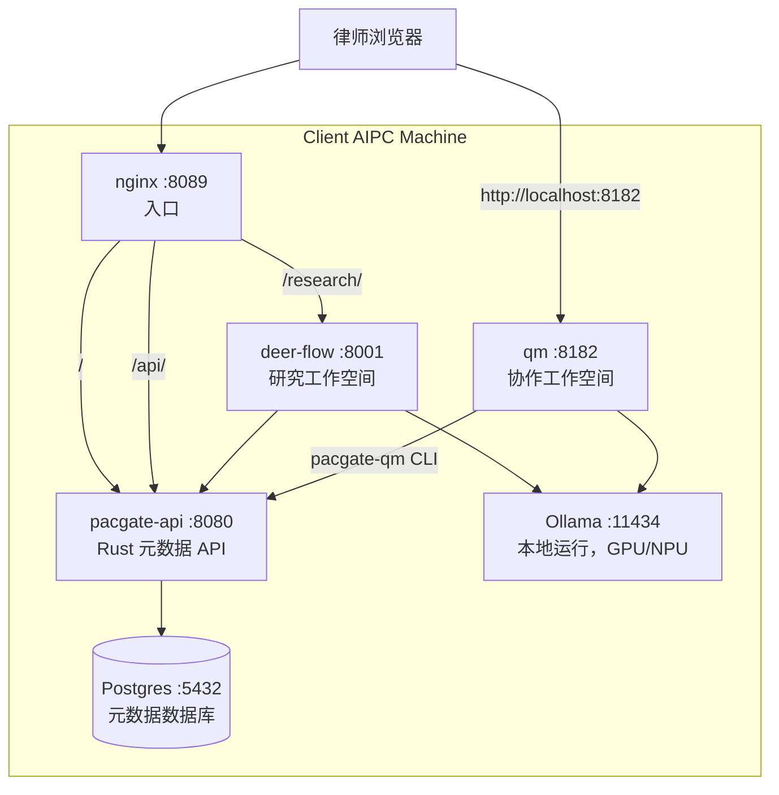

# Pacgate-ai 安装与运维指南

> 供智方云工程师使用 - Pacgate-law 现场 3 天游走安装
> 版本 0.1.0 - Phase 1 试点

## 1. 概览

### 1.1 安装内容

- 两台 AIPC 机器，预装 Cubecloud Agent OS 表层
- Pacgate-ai 运行栈（pacgate-api + deer-flow + Postgres + nginx）
- qm 协作工作空间（通过 `qm up` 独立运行）
- Ollama 及预先拉取的法律模型
- 220 个法律工作流模板 + 30 个角色（预加载到 pacgate-api）

### 1.2 架构



### 1.3 各组件放在哪里

| 组件 | 位置 | 所有者 |
|---|---|---|
| pacgate-api | Docker 容器（GHCR 镜像） | 智方云 |
| deer-flow | Docker 容器（GHCR 镜像） | 智方云 |
| qm | Docker 容器（通过 `qm up`） | 智方云 |
| Postgres | Docker 容器（命名卷） | 客户数据 |
| `./data/tenants/` | 主机文件系统（卷挂载） | 客户数据 |
| Ollama | Windows 本机运行（非 Docker） | 客户 |
| Agent OS 表层 | 本机运行（Hermes、Open WebUI 等） | 智方云 |
| `.env` | 主机文件系统（gitignored） | 客户密钥 |
| 工作流 YAML | 客户包 `workflows/`（参考） | 智方云 |

## 2. 安装前准备（第 1 天，进场前）

### 2.1 构建并验证 GHCR 镜像

```powershell
cd c:\Users\cubecloud-io\github-pr\pacgate-ai-pr

# 构建 pacgate-api（Rust 1.94 多阶段）
docker build -t ghcr.io/pacgate-ai/pacgate-api:0.1.3 -f pacgate-ai/Dockerfile ./pacgate-ai

# 构建 pacgate-mcp 桥接镜像
docker build -t ghcr.io/pacgate-ai/pacgate-mcp:0.1.3 -f deploy/pacgate-mcp/Dockerfile ./deploy/pacgate-mcp

# 构建 deer-flow 包装镜像
docker build -t ghcr.io/pacgate-ai/deer-flow-pacgate:0.1.0 -f deploy/deer-flow-pacgate/Dockerfile .

# 构建 deer-flow 前端（构建时烘焙网关地址）
.\deploy\build-frontend.ps1 -Push

# 推送
docker push ghcr.io/pacgate-ai/pacgate-api:0.1.3
docker push ghcr.io/pacgate-ai/pacgate-mcp:0.1.3
docker push ghcr.io/pacgate-ai/deer-flow-pacgate:0.1.0
docker push ghcr.io/pacgate-ai/deer-flow-frontend-pacgate:0.1.0

# 验证可拉取
docker pull ghcr.io/pacgate-ai/pacgate-api:0.1.3
docker pull ghcr.io/pacgate-ai/deer-flow-pacgate:0.1.0
```

注意：qm 没有 Docker 镜像，它通过 `deploy/qm-pacgate/` 目录里的 `qm up` 独立运行。

### 2.2 准备客户端安装包

客户端安装包位于 `deploy/client-bundle/`。请确认其中包含：

```
client-bundle/
├── compose.prod.yaml          ← pacgate-api + deer-flow + nginx + Postgres 的 Docker Compose
├── nginx/
│   └── default.conf           ← 运行时 nginx（路由 /api/ 和 /research/）
├── .env.example               ← 客户填写数据库密码 + JWT 密钥
├── install.ps1                ← 一键 Windows 安装脚本
├── ollama-models.txt          ← 需要预先拉取的模型
├── deer-flow-config.yaml      ← deer-flow 多模型配置（5 个模型，可切换）
├── setup-qm.ps1               ← qm 启动脚本（生成密钥、创建 .env）
├── README-client.md           ← 客户 IT 快速开始
├── workflows/                 ← 15 个 YAML 文件，220 个工作流模板（参考）
└── personas/
    └── README.md              ← 20 个执业领域 + 10 个 SOUL 角色参考
```

打包：`Compress-Archive deploy/client-bundle/* pacgate-client-bundle-v0.1.0.zip`

另外，请单独复制 `deploy/qm-pacgate/` - 它要和客户端安装包一起放到客户机器上。

### 2.3 准备 qm 部署

```powershell
cd deploy/qm-pacgate
npm ci            # 或 npm install
npm exec qm -- check       # 必须通过
npm exec qm -- sandbox build  # 必须成功构建
```

## 3. 安装第 1 天 - 硬件与基础软件

### 3.1 开箱并配置 AIPC 机器

- 连接 GPU 扩展坞
- 在 BIOS 中启用虚拟化
- 安装 Windows 11 更新
- 安装 AMD Adrenalin 驱动（GPU）
- 安装 Docker Desktop（WSL2 后端）
- 安装 Ollama（来自 ollama.com 的 Windows 原生版本）
- 安装 Node.js 24+（供 qm 使用）

### 3.2 拉取 Ollama 模型

```powershell
ollama pull deepseek-v4-flash:0731-cloud
ollama pull deepseek-v4-pro:0813-cloud
ollama pull nomic-embed-text:latest
ollama list   # 验证
```

### 3.3 部署客户端安装包

```powershell
# 将 zip 拷贝到 C:\pacgate
Expand-Archive pacgate-client-bundle-v0.1.0.zip -DestinationPath C:\pacgate
cd C:\pacgate

# 配置
copy .env.example .env
notepad .env    # 填写 PACGATE_DB_PASSWORD、PACGATE_JWT_SECRET、PACGATE_TENANT_ID

# 运行安装脚本
.\install.ps1
```

验证：
```powershell
docker compose -f compose.prod.yaml ps    # 所有服务都应运行
curl http://localhost:8089/health    # 返回 ok
```

### 3.4 初始化默认租户

pacgate-api 要求先有租户，用户注册才会生效。

```powershell
# 在 Postgres 中创建租户
docker exec pacgate-db psql -U pacgate -c "INSERT INTO tenants (name, slug) VALUES ('Pacgate Law', 'pacgate-law');"

# 注册管理员用户
$body = @{email="admin@pacgate-law.com"; password="<strong-password>"} | ConvertTo-Json
Invoke-RestMethod -Uri "http://localhost:8089/api/auth/register" -Method POST -Body $body -ContentType "application/json"
```

## 4. 安装第 2 天 - qm + Agent OS 表层

### 4.1 设置 qm 协作工作空间

```powershell
# 1. 在 pacgate-api 中注册 bridge 服务账号
$body = @{email="qm-bridge@pacgate.local"; password="<generate-strong-password>"} | ConvertTo-Json
Invoke-RestMethod -Uri "http://localhost:8089/api/auth/register" -Method POST -Body $body -ContentType "application/json"

# 2. 把 qm-pacgate 复制到客户机器
Copy-Item -Path qm-pacgate -Destination C:\pacgate\qm-pacgate -Recurse

# 3. 运行启动脚本
cd C:\pacgate
.\setup-qm.ps1
# 该脚本会生成签名密钥、创建 .env、提示输入管理员邮箱
# 和 bridge 凭据，并运行 qm check + sandbox build

# 4. 启动 qm
cd C:\pacgate\qm-pacgate
npm exec qm -- up

# 5. 验证
# 打开 http://localhost:8182 → qm Web UI 正常加载
# 使用管理员邮箱登录
```

### 4.2 配置 Cubecloud Agent OS 表层

以下是安装在 AIPC 本机上的 Cubecloud 内部工具：

- **Hermes**：配置记忆 + 任务追踪，指向 pacgate-api
- **Open WebUI**：连接 Ollama，配置法律系统提示词
- **OpenSpace**：设置团队工作空间和事项可见性
- **IronClaw**：配置安全边界 + 审批路径

### 4.3 验证 deer-flow 研究工作空间

```powershell
# 打开 http://localhost:8089/research/
# 先选择一个事项（如果还没有就先创建）
# 询问：“总结中国近期 force majeure（不可抗力）相关案例法”
# 验证：返回结果包含引用
# 验证：结果已保存到事项记忆中
```

### 4.4 验证 qm 协作工作空间

```powershell
# 在 qm 聊天里（http://localhost:8182）输入：
# “列出可用的 Pacgate 工作流”
# agent 应调用 pacgate-qm 并返回工作流分类

# 然后输入：
# “为 Channel Alpha 事项执行合同审查工作流”
# agent 应调用 pacgate-qm execute-workflow
```

## 5. 安装第 3 天 - 培训 + 交接

### 5.1 管理员培训

向客户 IT 管理员演示以下内容：

| 任务 | 命令 |
|------|------|
| 启动/停止栈 | `docker compose -f compose.prod.yaml up -d` / `down` |
| 更新 | `.\install.ps1 -Update` |
| 查看日志 | `docker compose -f compose.prod.yaml logs -f` |
| 切换 deer-flow 模型 | 编辑 `deer-flow-config.yaml`，重启 deer-flow 容器 |
| 切换 qm 模型 | 编辑 `qm.config.jsonc` 中的 `MODEL_NAME`，然后 `qm down` + `qm up` |
| 注册新用户 | `POST /api/auth/register` |
| 备份数据库 | `docker exec pacgate-db pg_dump -U pacgate pacgate > backup.sql` |
| 检查服务健康 | `curl http://localhost:8089/health` |

### 5.2 律师培训

按 `deploy/USER-MANUAL.md` 演示：
- 研究模式（deer-flow，`http://localhost:8089/research/`）
- 协作模式（qm，`http://localhost:8182`）
- 文档上传 + 工作流执行

### 5.3 交接清单

- [ ] 两台 AIPC 机器都已运行
- [ ] Docker 栈健康（`docker compose ps`）
- [ ] qm 已运行（`npm exec qm -- status`）
- [ ] Ollama 模型已拉取（`ollama list`）
- [ ] 默认租户已在 pacgate-api 中初始化
- [ ] 管理员用户已注册
- [ ] Bridge 服务账号已注册
- [ ] 如需局域网访问，端口 8089 的防火墙规则已放行
- [ ] Agent OS 表层已配置完成
- [ ] 律师已完成培训
- [ ] `.env` 已安全备份（不要放进 git）
- [ ] qm `.env` 已安全备份（包含签名密钥）

## 6. 运维

### 6.1 切换模型（deer-flow）

1. 编辑 `C:\pacgate\deer-flow-config.yaml`
2. 调整 `models` 列表顺序（第一项即默认模型）
3. 重启：`docker compose -f compose.prod.yaml restart deer-flow`
4. 验证：打开 `http://localhost:8089/research/` 并发送测试消息

### 6.2 切换模型（qm）

1. 编辑 `C:\pacgate\qm-pacgate\qm.config.jsonc`
2. 修改 `MODEL_NAME` 为所需的 Ollama 模型
3. 重启：`cd C:\pacgate\qm-pacgate && npm exec qm -- down && npm exec qm -- up`
4. 验证：打开 `http://localhost:8182` 并发送测试消息

### 6.3 新增律师用户

```powershell
$body = @{email="new.attorney@pacgate-law.com"; password="<temp-password>"} | ConvertTo-Json
Invoke-RestMethod -Uri "http://localhost:8089/api/auth/register" -Method POST -Body $body -ContentType "application/json"
```

该用户现在可以同时登录研究（deer-flow）和协作（qm）两个入口。
如有需要，可通过 pacgate-api 管理端接口给该用户分配 SOUL 角色。

### 6.4 更新栈

1. 智方云发布新的客户端安装包版本
2. 客户 AIPC 上执行：`.install.ps1 -Update`
3. 这会拉取新的 GHCR 镜像并重启容器
4. `./data/tenants/` 会保留（卷挂载）
5. Postgres 数据会保留（命名卷）

### 6.5 备份

| 内容 | 方法 | 频率 |
|------|------|------|
| 事项数据 | 复制 `C:\pacgate\data\tenants\` | 每周 |
| 数据库 | `docker exec pacgate-db pg_dump -U pacgate pacgate > backup.sql` | 每周 |
| qm 状态 | 备份 `C:\pacgate\qm-pacgate\.env`（包含签名密钥） | 安装时一次 |
| `.env` | 安全备份 `C:\pacgate\.env` | 安装时一次 |

## 7. 故障排查

### 容器起不来

```powershell
# 检查 .env 里是否是真实值（不是占位符）
Get-Content .env

# 检查 Docker Desktop 是否启动
docker info

# 检查 8089 端口是否被占用
netstat -an | findstr 8089

# 检查日志
docker compose -f compose.prod.yaml logs <service>
```

### 容器访问不到 Ollama

```powershell
ollama list    # 应该能看到模型
docker run --rm curlimages/curl http://host.docker.internal:11434/api/tags
# 如果失败：检查 Ollama 是否作为 Windows 服务运行
```

### GPU 没有被识别

```powershell
ollama ps    # 输出里应该能看到 GPU
# 如果没有 GPU：检查 AMD Adrenalin 驱动，检查 BIOS 是否启用虚拟化
```

### qm 启动失败

```powershell
cd C:\pacgate\qm-pacgate
npm exec qm -- check    # 校验配置
# 检查 .env 是否有所有必需密钥（不能留空）
# 检查签名密钥是否为 64 位十六进制字符串
# 检查 PACGATE_API_EMAIL / PASSWORD 是否正确
# 测试 bridge 登录：
#   $body = @{email="$env:PACGATE_API_EMAIL"; password="$env:PACGATE_API_PASSWORD"} | ConvertTo-Json
#   Invoke-RestMethod -Uri "http://localhost:8089/api/auth/login" -Method POST -Body $body -ContentType "application/json"
```

### deer-flow 报错

```powershell
curl http://localhost:8089/health    # 检查 API 是否健康
ollama show deepseek-v4-flash:0731-cloud  # 检查模型是否合法
docker compose -f compose.prod.yaml logs deer-flow  # 查看日志
```

## 8. 架构参考

### 8.1 GHCR 镜像

| 镜像 | 内容 | 基础镜像 |
|---|---|---|
| `ghcr.io/pacgate-ai/pacgate-api:0.1.3` | Rust 二进制（pacgate-server）+ SQL migrations | `rust:1.94-bookworm` → `debian:bookworm-slim` |
| `ghcr.io/pacgate-ai/deer-flow-pacgate:0.1.0` | deer-flow 后端 + Python 适配器（176 行） | `ghcr.io/bytedance/deer-flow-backend`（固定 SHA） |
| `ghcr.io/pacgate-ai/pacgate-mcp:0.1.3` | pacgate-api MCP 桥接（10 个工具） | `python:3.12-slim` |
| `ghcr.io/pacgate-ai/deer-flow-frontend-pacgate:0.1.0` | deer-flow Next.js 检索界面 | `node:22-alpine` |

### 8.2 数据流

1. 律师打开 `http://localhost:8089` → nginx → pacgate-api（着陆页）
2. 律师进入 `/research/` → nginx → deer-flow（研究工作空间）
3. deer-flow 调用 pacgate-api 获取事项记忆 + 文档存储
4. deer-flow 调用 Ollama 进行模型推理
5. 律师打开 `http://localhost:8182` → qm（协作工作空间）
6. qm agent 调用 `pacgate-qm` CLI → pacgate-api（工作流执行）

### 8.3 不进入任何镜像的内容（客户数据）

- `./data/tenants/{tenant_id}/` - 事项、文档、记忆
- Postgres 数据卷 - 元数据库
- `.env` - 密钥
- qm `.env` - 签名密钥 + bridge 凭据

### 8.4 参考文档

| 文档 | 面向对象 | 位置 |
|---|---|---|
| 本指南 | 智方云工程师（现场安装） | `deploy/SETUP-AND-OPERATIONS-ZH.md` |
| Deployment Guide | 智方云工程师（构建参考） | `deploy/DEPLOYMENT-GUIDE.md` |
| User Manual | 律师（日常使用） | `deploy/USER-MANUAL.md` |
| Client README | 客户 IT（快速开始） | `deploy/client-bundle/README-client.md` |
| Architecture Diagrams | 技术参考 | `deploy/ARCHITECTURE-DIAGRAMS.md` |
| Architecture Plans | 架构备忘 | `deploy/PLANS.md` |