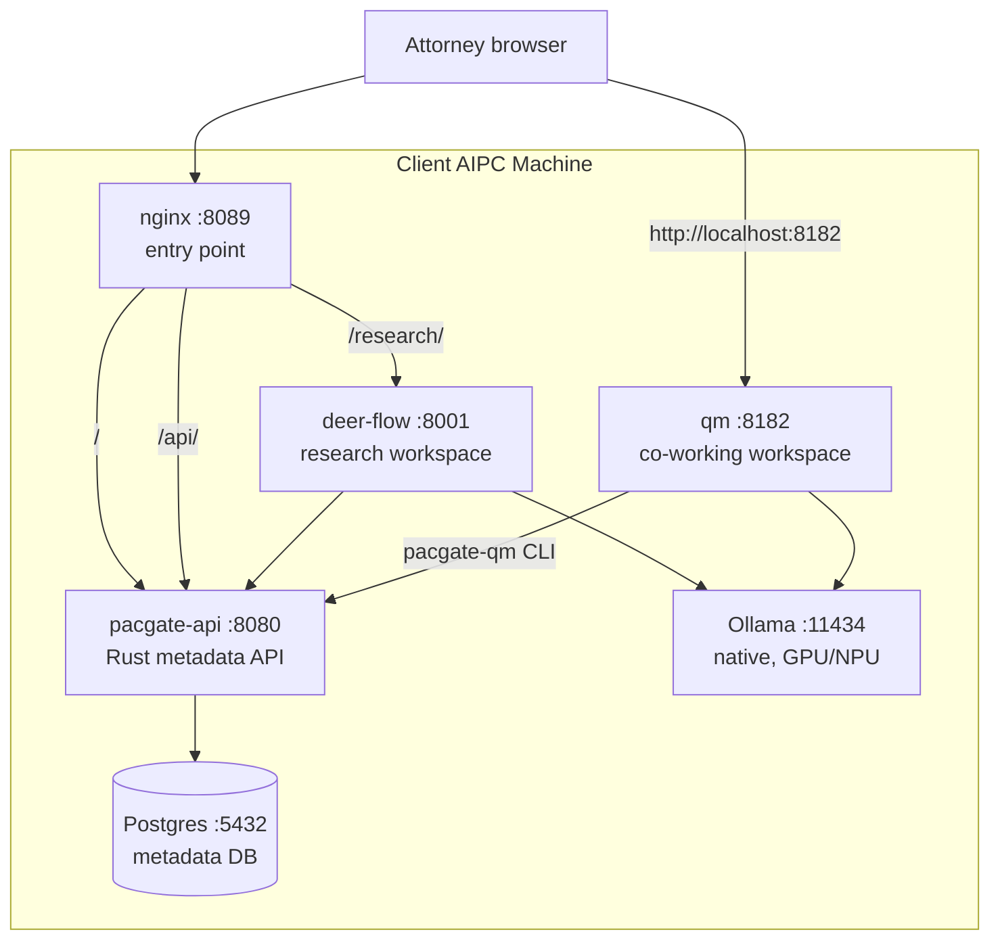

# Pacgate-ai Setup & Operations Guide

> For Cubecloud engineers — 3-day on-site installation at Pacgate-law
> Version 0.1.0 — Phase 1 pilot

## 1. Overview

### 1.1 What gets installed

- Two AIPC machines with Cubecloud agent OS surface
- Pacgate-ai runtime stack (pacgate-api + deer-flow + Postgres + nginx)
- qm co-working workspace (runs separately via `qm up`)
- Ollama with pre-pulled legal models
- 220 legal workflow templates + 30 personas (pre-loaded in pacgate-api)

### 1.2 Architecture



### 1.3 What lives where

| Component | Location | Owner |
|---|---|---|
| pacgate-api | Docker container (GHCR image) | Cubecloud |
| deer-flow | Docker container (GHCR image) | Cubecloud |
| qm | Docker containers (`qm up`) | Cubecloud |
| Postgres | Docker container (named volume) | Client data |
| `./data/tenants/` | Host filesystem (volume mount) | Client data |
| Ollama | Native Windows (not Docker) | Client |
| Agent OS surface | Native (Hermes, Open WebUI, etc.) | Cubecloud |
| `.env` | Host filesystem (gitignored) | Client secrets |
| Workflow YAMLs | Client bundle `workflows/` (reference) | Cubecloud |

## 2. Pre-installation (Day 1, before arriving on-site)

### 2.1 Build + verify GHCR images

```powershell
cd c:\Users\cubecloud-io\github-pr\pacgate-ai-pr

# Build pacgate-api (Rust 1.94 multi-stage)
docker build -t ghcr.io/pacgate-ai/pacgate-api:0.1.3 -f pacgate-ai/Dockerfile ./pacgate-ai

# Build pacgate-mcp bridge
docker build -t ghcr.io/pacgate-ai/pacgate-mcp:0.1.3 -f deploy/pacgate-mcp/Dockerfile ./deploy/pacgate-mcp

# Build deer-flow wrapper
docker build -t ghcr.io/pacgate-ai/deer-flow-pacgate:0.1.0 -f deploy/deer-flow-pacgate/Dockerfile .

# Build deer-flow frontend (gateway URL baked in)
.\deploy\build-frontend.ps1 -Push

# Push images
docker push ghcr.io/pacgate-ai/pacgate-api:0.1.3
docker push ghcr.io/pacgate-ai/pacgate-mcp:0.1.3
docker push ghcr.io/pacgate-ai/deer-flow-pacgate:0.1.0
docker push ghcr.io/pacgate-ai/deer-flow-frontend-pacgate:0.1.0

# Verify pullable
docker pull ghcr.io/pacgate-ai/pacgate-api:0.1.3
docker pull ghcr.io/pacgate-ai/deer-flow-pacgate:0.1.0
```

Note: qm does NOT have a Docker image — it runs via `qm up` from the
`deploy/qm-pacgate/` deployment directory.

### 2.2 Prepare the client bundle

The client bundle is at `deploy/client-bundle/`. Verify it contains:

```
client-bundle/
├── compose.prod.yaml          ← Docker Compose for pacgate-api + deer-flow + nginx + Postgres
├── nginx/
│   └── default.conf           ← Runtime nginx (routes /api/ and /research/)
├── .env.example               ← Client fills in DB password + JWT secret
├── install.ps1                ← One-click Windows installer
├── ollama-models.txt          ← Models to pre-pull
├── deer-flow-config.yaml      ← Multi-model deer-flow config (5 models, switchable)
├── setup-qm.ps1               ← qm bootstrap script (generates secrets, creates .env)
├── README-client.md           ← Quick-start for client IT
├── workflows/                 ← 15 YAML files, 220 workflow templates (reference)
└── personas/
    └── README.md              ← 20 practice-area + 10 SOUL personas reference
```

Zip it: `Compress-Archive deploy/client-bundle/* pacgate-client-bundle-v0.1.0.zip`

Also copy `deploy/qm-pacgate/` separately — it goes on the client machine
next to the client bundle.

### 2.3 Prepare the qm deployment

```powershell
cd deploy/qm-pacgate
npm ci            # or npm install
npm exec qm -- check       # must pass
npm exec qm -- sandbox build  # must build successfully
```

## 3. Installation Day 1 — Hardware + base software

### 3.1 Unbox and configure AIPC machines

- Connect GPU docks
- Enable virtualization in BIOS
- Install Windows 11 updates
- Install AMD Adrenalin drivers (for GPU)
- Install Docker Desktop (WSL2 backend)
- Install Ollama (native Windows from ollama.com)
- Install Node.js 24+ (for qm)

### 3.2 Pull Ollama models

```powershell
ollama pull deepseek-v4-flash:0731-cloud
ollama pull deepseek-v4-pro:0813-cloud
ollama pull nomic-embed-text:latest
ollama list   # verify
```

### 3.3 Deploy the client bundle

```powershell
# Copy zip to C:\pacgate
Expand-Archive pacgate-client-bundle-v0.1.0.zip -DestinationPath C:\pacgate
cd C:\pacgate

# Configure
copy .env.example .env
notepad .env    # fill in PACGATE_DB_PASSWORD, PACGATE_JWT_SECRET, PACGATE_TENANT_ID

# Run installer
.\install.ps1
```

Verify:
```powershell
docker compose -f compose.prod.yaml ps    # all services running
curl http://localhost:8089/health    # ok
```

### 3.4 Seed the default tenant

The pacgate-api requires a tenant to exist before user registration works.

```powershell
# Create the tenant in Postgres
docker exec pacgate-db psql -U pacgate -c "INSERT INTO tenants (name, slug) VALUES ('Pacgate Law', 'pacgate-law');"

# Register the admin user
$body = @{email="admin@pacgate-law.com"; password="<strong-password>"} | ConvertTo-Json
Invoke-RestMethod -Uri "http://localhost:8089/api/auth/register" -Method POST -Body $body -ContentType "application/json"
```

## 4. Installation Day 2 — qm + agent OS surface

### 4.1 Set up qm co-working workspace

```powershell
# 1. Register a bridge service account in pacgate-api
$body = @{email="qm-bridge@pacgate.local"; password="<generate-strong-password>"} | ConvertTo-Json
Invoke-RestMethod -Uri "http://localhost:8089/api/auth/register" -Method POST -Body $body -ContentType "application/json"

# 2. Copy qm-pacgate to the client machine
Copy-Item -Path qm-pacgate -Destination C:\pacgate\qm-pacgate -Recurse

# 3. Run the bootstrap script
cd C:\pacgate
.\setup-qm.ps1
# This generates signing secrets, creates .env, prompts for admin email
# and bridge credentials, runs qm check + sandbox build

# 4. Start qm
cd C:\pacgate\qm-pacgate
npm exec qm -- up

# 5. Verify
# Open http://localhost:8182 → qm web UI loads
# Sign in with the admin email
```

### 4.2 Configure Cubecloud agent OS surface

These are Cubecloud-internal tools installed natively on the AIPC:

- **Hermes**: configure memory + task tracking to point to pacgate-api
- **Open WebUI**: connect to Ollama, configure legal system prompts
- **OpenSpace**: set up team workspace with matter visibility
- **IronClaw**: configure security boundaries + approval paths

### 4.3 Verify deer-flow research workspace

```powershell
# Open http://localhost:8089/research/
# Select a matter (create one first if none exist)
# Ask: "Summarize recent force majeure case law in China"
# Verify: response includes citations
# Verify: response is saved to matter memory
```

### 4.4 Verify qm co-working workspace

```powershell
# In qm chat (http://localhost:8182), ask:
# "List available pacgate workflows"
# The agent should call pacgate-qm and return workflow categories

# Then ask:
# "Execute a contract review workflow for matter Channel Alpha"
# The agent should call pacgate-qm execute-workflow
```

## 5. Installation Day 3 — Training + handoff

### 5.1 Admin training

Show the client IT admin how to:

| Task | Command |
|------|---------|
| Start/stop stack | `docker compose -f compose.prod.yaml up -d` / `down` |
| Update | `.\install.ps1 -Update` |
| Check logs | `docker compose -f compose.prod.yaml logs -f` |
| Switch deer-flow model | Edit `deer-flow-config.yaml`, restart deer-flow container |
| Switch qm model | Edit `qm.config.jsonc` MODEL_NAME, `qm down` + `qm up` |
| Register new user | `POST /api/auth/register` |
| Backup database | `docker exec pacgate-db pg_dump -U pacgate pacgate > backup.sql` |
| Check service health | `curl http://localhost:8089/health` |

### 5.2 Attorney training

Walk through `deploy/USER-MANUAL.md`:
- Demo research mode (deer-flow at `http://localhost:8089/research/`)
- Demo co-working mode (qm at `http://localhost:8182`)
- Demo document upload + workflow execution

### 5.3 Handoff checklist

- [ ] Both AIPC machines running
- [ ] Docker stack healthy (`docker compose ps`)
- [ ] qm running (`npm exec qm -- status`)
- [ ] Ollama models pulled (`ollama list`)
- [ ] Default tenant seeded in pacgate-api
- [ ] Admin user registered
- [ ] Bridge service account registered
- [ ] Firewall rule for port 8089 (if LAN access needed)
- [ ] Agent OS surface configured
- [ ] Attorneys trained
- [ ] `.env` backed up securely (NOT in git)
- [ ] qm `.env` backed up securely (contains signing keys)

## 6. Operations

### 6.1 Switching models (deer-flow)

1. Edit `C:\pacgate\deer-flow-config.yaml`
2. Reorder the `models` list (first entry = default)
3. Restart: `docker compose -f compose.prod.yaml restart deer-flow`
4. Verify: open `http://localhost:8089/research/` and send a test message

### 6.2 Switching models (qm)

1. Edit `C:\pacgate\qm-pacgate\qm.config.jsonc`
2. Change `MODEL_NAME` to the desired Ollama model
3. Restart: `cd C:\pacgate\qm-pacgate && npm exec qm -- down && npm exec qm -- up`
4. Verify: open `http://localhost:8182` and send a test message

### 6.3 Adding a new attorney user

```powershell
$body = @{email="new.attorney@pacgate-law.com"; password="<temp-password>"} | ConvertTo-Json
Invoke-RestMethod -Uri "http://localhost:8089/api/auth/register" -Method POST -Body $body -ContentType "application/json"
```

The user can now log in to both research (deer-flow) and co-working (qm).
Assign a SOUL persona via the pacgate-api admin endpoint if needed.

### 6.4 Updating the stack

1. Cubecloud ships a new client bundle version
2. On the client AIPC: `.\install.ps1 -Update`
3. This pulls new GHCR images and restarts containers
4. `./data/tenants/` is preserved (volume mount)
5. Postgres data is preserved (named volume)

### 6.5 Backup

| What | How | Frequency |
|------|-----|-----------|
| Matter data | Copy `C:\pacgate\data\tenants\` | Weekly |
| Database | `docker exec pacgate-db pg_dump -U pacgate pacgate > backup.sql` | Weekly |
| qm state | Backup `C:\pacgate\qm-pacgate\.env` (contains signing keys) | Once (on install) |
| .env | Backup `C:\pacgate\.env` securely | Once (on install) |

## 7. Troubleshooting

### Containers won't start

```powershell
# Check .env has real values (not placeholders)
Get-Content .env

# Check Docker Desktop is running
docker info

# Check port 8089 is not in use
netstat -an | findstr 8089

# Check logs
docker compose -f compose.prod.yaml logs <service>
```

### Ollama not reachable from containers

```powershell
ollama list    # should show models
docker run --rm curlimages/curl http://host.docker.internal:11434/api/tags
# If failed: check Ollama is running as a Windows service
```

### GPU not detected

```powershell
ollama ps    # should show GPU in output
# If no GPU: check AMD Adrenalin driver, check virtualization in BIOS
```

### qm won't start

```powershell
cd C:\pacgate\qm-pacgate
npm exec qm -- check    # validate config
# Check .env has all required secrets (no blank values)
# Check signing secrets are 64-char hex strings
# Check PACGATE_API_EMAIL/PASSWORD are correct
# Test bridge login:
#   $body = @{email="$env:PACGATE_API_EMAIL"; password="$env:PACGATE_API_PASSWORD"} | ConvertTo-Json
#   Invoke-RestMethod -Uri "http://localhost:8089/api/auth/login" -Method POST -Body $body -ContentType "application/json"
```

### deer-flow returns errors

```powershell
curl http://localhost:8089/health    # check API is healthy
ollama show deepseek-v4-flash:0731-cloud  # check model is valid
docker compose -f compose.prod.yaml logs deer-flow  # check logs
```

## 8. Architecture reference

### 8.1 GHCR images

| Image | Contains | Base |
|---|---|---|
| `ghcr.io/pacgate-ai/pacgate-api:0.1.3` | Rust binary (`pacgate-server`) + SQL migrations | `rust:1.94-bookworm` \u2192 `debian:bookworm-slim` |
| `ghcr.io/pacgate-ai/deer-flow-pacgate:0.1.0` | deer-flow backend + Python adapter (176 lines) | `ghcr.io/bytedance/deer-flow-backend` (pinned SHA) |
| `ghcr.io/pacgate-ai/pacgate-mcp:0.1.3` | pacgate-api MCP bridge (10 tools) | `python:3.12-slim` |
| `ghcr.io/pacgate-ai/deer-flow-frontend-pacgate:0.1.0` | deer-flow Next.js research UI | `node:22-alpine` |

### 8.2 Data flow

1. Attorney opens `http://localhost:8089` → nginx → pacgate-api (landing)
2. Attorney goes to `/research/` → nginx → deer-flow (research workspace)
3. deer-flow calls pacgate-api for matter memory + document storage
4. deer-flow calls Ollama for model inference
5. Attorney goes to `http://localhost:8182` → qm (co-working workspace)
6. qm agent calls `pacgate-qm` CLI → pacgate-api (workflow execution)

### 8.3 What's NOT in any image (client data)

- `./data/tenants/{tenant_id}/` — matters, documents, memory
- Postgres data volume — metadata database
- `.env` — secrets
- qm `.env` — signing keys + bridge credentials

### 8.4 Reference documents

| Document | Audience | Location |
|---|---|---|
| This guide | Cubecloud engineer (on-site install) | `deploy/SETUP-AND-OPERATIONS.md` |
| Deployment Guide | Cubecloud engineer (build reference) | `deploy/DEPLOYMENT-GUIDE.md` |
| User Manual | Attorneys (day-to-day usage) | `deploy/USER-MANUAL.md` |
| Client README | Client IT (quick start) | `deploy/client-bundle/README-client.md` |
| Chinese client PDF | Client IT / on-site install (ZH) | `docs/SETUP-AND-OPERATIONS-ZH.pdf` |
| Architecture Diagrams | Technical reference | `deploy/ARCHITECTURE-DIAGRAMS.md` |
| Architecture Plans | Architecture memo | `deploy/PLANS.md` |