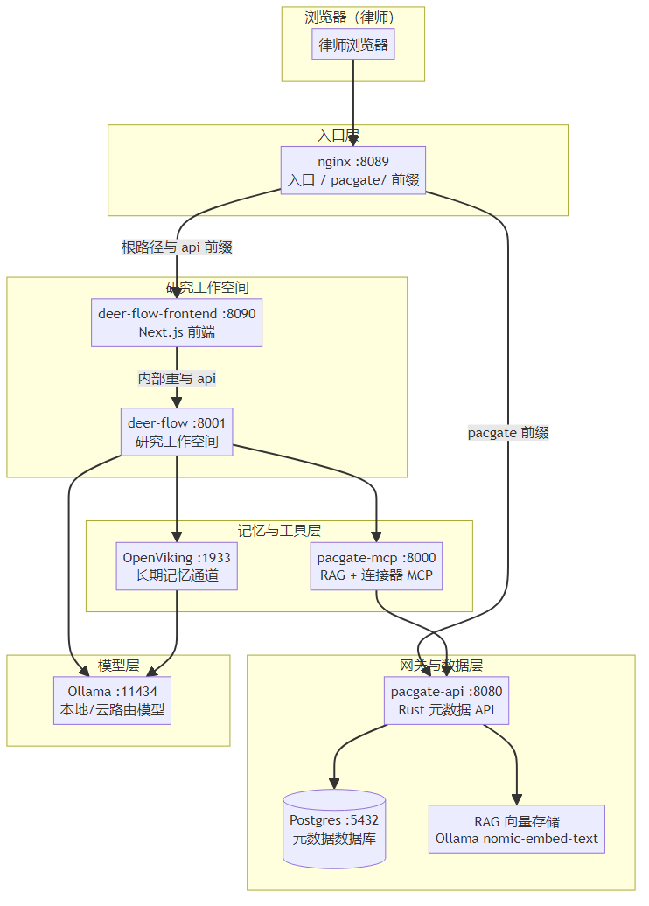

# deer-flow + OpenViking + pacgate-ai 网关 集成手册

> 面向律师事务所技术团队与运维工程师
> 版本 0.1.0 — 2026-09-04
> 中文版（PDF） | 英文版：[deer-flow-openviking-pacgate-handbook.md](deer-flow-openviking-pacgate-handbook.md)

---

## 1. 手册说明

本手册面向需要部署、运维与理解 **deer-flow（研究工作空间）+ OpenViking（长期记忆）+ pacgate-ai 网关（法律元数据与 RAG 服务）** 三位一体的技术团队。

它回答三个问题：

1. **这三者如何连接？** —— 架构与数据流
2. **每个组件做什么？** —— 功能与职责
3. **如何部署与排障？** —— 安装步骤与常见问题

> **红线**：本系统中的所有 AI 输出均为**律师复核前的草稿**，绝不构成最终法律意见，也绝不静默捏造事实。这一原则贯穿全部组件。

---

## 2. 系统架构

### 2.1 三层数据流



### 2.2 组件职责

| 组件 | 端口 | 职责 | 实现 |
|---|---|---|---|
| **deer-flow** | 8001 | 研究工作空间：多步骤检索、文件分析、报告生成 | `ghcr.io/jzkk720/deer-flow-pacgate:0.1.0`（包装镜像） |
| **deer-flow-frontend** | 8090 | Next.js 前端，重写 `/api/*` 到 deer-flow 网关 | `ghcr.io/bytedance/deer-flow-frontend:latest` |
| **OpenViking** | 1933 | 长期记忆：结构化记忆、语义检索、跨会话上下文 | `ghcr.io/volcengine/openviking` |
| **pacgate-mcp** | 8000 | 向 deer-flow 暴露 RAG + 法律连接器检索（FastMCP） | `pacgate-mcp:0.1.0` |
| **pacgate-api** | 8080 | 法律元数据：案件、文档、工作流、RAG、连接器 | `ghcr.io/jzkk720/pacgate-api:0.1.3`（Rust） |
| **pacgate-nginx** | 8089 | 统一入口，路由 `/`、`/api/`、`/pacgate/` | `nginx:1.27-alpine` |
| **pacgate-db** | 5432 | 元数据数据库（租户、案件、文档、审计） | `postgres:16-alpine` |
| **Ollama** | 11434 | 本地/云路由模型 + embedding | Windows 原生 |

---

## 3. deer-flow：研究工作空间

### 3.1 它是什么

deer-flow 是 Pacgate-ai 的**研究工作空间**。律师在浏览器中打开它，用自然语言下达检索、文件分析、合同审查与报告生成任务。AI 将请求拆解为多个步骤，调用工具检索知识库与文件，最后输出**带引用出处**的结构化回答。

### 3.2 关键技术点

deer-flow 通过**包装镜像**（wrapper image）集成 Pacgate，而非 fork 源码。它基于 `ghcr.io/bytedance/deer-flow-backend`，在其上：

- 通过 `pip install` 安装 `pacgate_deerflow_adapter` 适配器
- 通过 `config.yaml` 启用 Pacgate 记忆后端（`PacgateMemoryStorage`）
- 通过 `extensions_config.json` 注册外部 MCP 服务器

**启动命令**（容器内）：
```bash
cd backend && uv run --no-sync uvicorn app.gateway.app:app --host 0.0.0.0 --port 8001
```

### 3.3 模型配置

`config.yaml` 定义了 deer-flow 可用的模型列表（全部通过 Ollama 路由）：

| 模型 | 说明 | 用途 |
|---|---|---|
| `deepseek-v4-flash:0731-cloud` | DeepSeek V4 Flash 0731（云路由） | 快速法律执行模型 |
| `deepseek-v4-pro:0813-cloud` | DeepSeek V4 Pro 0813（云路由） | 复杂检索任务 |
| `qwen3.8:27b-mtp-q4_K_M` | Qwen 3.8 27B（本地 GPU） | 无云依赖 |
| `nemotron-3.5-lightning:30b-a3b` | Nemotron 3.5 Lightning 30B（本地 GPU） | 法律推理 |
| `gemma4:26b-a4b-it-qat` | Gemma 4 26B（本地 GPU） | 草稿生成 |

> **切换模型**：调整 `models` 列表的顺序，把优先模型放在最前。所有模型使用 `api_key: ollama` 与 `base_url: http://host.docker.internal:11434/v1`。

### 3.4 记忆后端

```yaml
memory:
  storage_class: pacgate_deerflow_adapter.storage.PacgateMemoryStorage
```

`PacgateMemoryStorage` 需要 `PACGATE_MATTER_ID` 才能绑定到具体案件。若缺失，会**静默回退**到本地文件。这是早期"deer-flow 无法查询法律数据库"的根因之一（见第 6 节排障）。

### 3.5 关键环境变量

| 变量 | 说明 |
|---|---|
| `DEER_FLOW_CONFIG_PATH` | deer-flow 配置路径（`/app/backend/config.yaml`） |
| `PYTHONPATH` | `/app/adapters:/app/backend`（暴露适配器） |
| `PACGATE_API_URL` | pacgate-api 地址（`http://pacgate-api:8080`） |
| `PACGATE_TENANT_ID` | 租户 ID（默认 `default-firm`） |
| `PACGATE_MATTER_ID` | 绑定到具体案件（记忆适配器必需） |

---

## 4. OpenViking：长期记忆通道

### 4.1 它是什么

OpenViking 是 Pacgate-ai 的**长期记忆**服务。它把跨会话的决策、偏好与工作知识提取为**结构化记忆**，供 AI 在后续会话中语义检索、回忆与复用。它是 MCP 服务器，deer-flow 像消费其他 MCP 一样消费它。

### 4.2 配置

OpenViking 通过 JSON 配置注入（`OPENVIKING_CONF_CONTENT`）：

```json
{
  "server": { "host": "0.0.0.0", "port": 1933, "root_api_key": "<OPENVIKING_ROOT_API_KEY>" },
  "storage": { "workspace": "/app/.openviking/workspace" },
  "embedding": {
    "dense": {
      "provider": "ollama",
      "api_base": "http://host.docker.internal:11434/v1",
      "model": "nomic-embed-text",
      "dimension": 768
    }
  }
}
```

### 4.3 关键点

- **端口**：`1933`（HTTP，对外暴露）
- **embedding**：使用 Ollama 的 `nomic-embed-text`（768 维）
- **root_api_key**：⚠️ 使用 `OPENVIKING_ROOT_API_KEY`，**不是** `OPENVIKING_API_KEY`（后者是应用密钥）。用错会导致 401，并回滚整个 MCP 工具加载。

### 4.4 与 pacgate-ai 网关的关系

OpenViking 记忆用于**会话上下文**：决策、偏好、工作知识。**绝不**通过 `ov-remember` 存储案件文件或保密案件材料——那些属于 pacgate 案件存储。

---

## 5. pacgate-ai 网关（pacgate-api）

### 5.1 它是什么

pacgate-api 是 Pacgate-ai 的**法律元数据网关**（Rust 实现）。它管理租户、案件、文档、工作流模板，并提供 RAG（向量检索）与法律连接器检索。

### 5.2 服务表面

| 服务 | 端点 | 说明 |
|---|---|---|
| **认证** | `POST /api/auth/login` | 登录并返回 JWT |
| **案件** | `GET /api/matters` | 列出案件 |
| **文档** | `GET /api/matters/:id/documents` | 某案件的文档 |
| **工作流** | `GET /api/workflows` | 列出工作流模板 |
| 工作流分类 | `GET /api/workflow-categories` | 工作流分类 |
| 工作流详情 | `GET /api/workflows/:id` | 单工作流步骤 |
| **RAG** | `GET /api/kb/search` | 内部按案件向量检索 |
| **连接器** | `GET /api/search` | 外部法律数据库检索 |
| 连接器列表 | `GET /api/search/connectors` | 可用法律数据源 |

### 5.3 数据模型（数据库迁移）

pacgate-api 的数据库迁移定义了核心表：

- `001_initial_schema.sql`：租户、用户、案件、文档、审计日志
- `002_rag_schema.sql`：RAG/向量存储
- `003_rag_enrichment.sql`：RAG 富化
- `004_data_level.sql`：数据分级
- `004_matter_external_keys.sql`：案件外部键（用于 QM 绑定）

### 5.4 工作流模板

pacgate-api 暴露 **10 个法律工作流模板**：

| 分类 | 工作流 | 步骤数 |
|---|---|---|
| contract_review | Contract Review（合同审查） | 3 |
| contract_review | Contract Comparison（合同比对） | 2 |
| due_diligence | Due Diligence Review（尽调审查） | 3 |
| legal_research | Legal Research Memo（法律检索备忘录） | 3 |
| tabular_review | Tabular Document Review（表格化文档审查） | 3 |
| document_generation | Contract Drafting（合同起草） | 2 |
| document_generation | Legal Opinion（法律意见书） | 2 |
| compliance | Compliance Check（合规检查） | 3 |
| ma | SPA Review（股权收购协议审查） | 3 |
| litigation | Discovery Review（证据开示审查） | 3 |

每个模板包含 `steps[]`，形如：
```json
{
  "category": "due_diligence",
  "name": "Due Diligence Review",
  "steps": [
    { "name": "List all documents", "tool": "list_documents" },
    { "name": "Extract key terms", "tool": "read_table_cells" },
    { "name": "Generate DD report", "tool": "generate_docx" }
  ]
}
```

### 5.5 pacgate-mcp 桥

`pacgate-mcp`（FastMCP，端口 8000）向 deer-flow 暴露三个工具，**deer-flow 永远看不到凭据**（认证在 pacgate-api 内部完成）：

| 工具 | 说明 |
|---|---|
| `pacgate_kb_search` | 内部按案件 RAG 检索（`GET /api/kb/search`） |
| `pacgate_connector_search` | 外部法律数据库检索（`GET /api/search`） |
| `pacgate_list_connectors` | 列出可用法律数据源连接器 |

它启动时用 `PACGATE_API_EMAIL`/`PACGATE_API_PASSWORD` 登录一次，之后在每次调用时转发 Bearer 令牌。

---

## 6. 部署

### 6.1 前置条件

- Docker Desktop（WSL2 后端）
- Ollama（Windows 原生）已拉取模型：`nomic-embed-text` 及法律模型
- Node.js 24+（供 qm 使用，若需）
- 访问私有 GitHub 仓库的权限

### 6.2 镜像

| 组件 | 镜像 |
|---|---|
| pacgate-api | `ghcr.io/jzkk720/pacgate-api:0.1.3` |
| deer-flow | `ghcr.io/jzkk720/deer-flow-pacgate:0.1.0` |
| deer-flow-frontend | `ghcr.io/bytedance/deer-flow-frontend:latest` |
| pacgate-mcp | `pacgate-mcp:0.1.0` |
| nginx | `nginx:1.27-alpine` |
| openviking | `ghcr.io/volcengine/openviking` |

### 6.3 启动

```powershell
cd deploy
docker compose -f compose.prod.yaml up -d
```

> **⚠️ 重要**：对 deer-flow 做配置变更时，使用 `docker compose restart deer-flow`，**不要**用 `--force-recreate`。deer-flow 的 SQLite 数据库、管理员、线程与 `.jwt_secret` 位于容器内部 `/app/backend/.deer-flow/`（未挂载），重建容器会丢失它们，导致前端 401 并出现 `/setup` 页面。

### 6.4 验证

```powershell
# 健康检查
curl http://localhost:8089/health

# pacgate-api 登录（获得 JWT）
$body = @{email="admin@pacgate-law.com"; password="<password>"} | ConvertTo-Json
Invoke-RestMethod -Uri "http://localhost:8089/pacgate/api/auth/login" -Method POST -Body $body -ContentType "application/json"

# 列出工作流模板
Invoke-RestMethod -Uri "http://localhost:8089/pacgate/api/workflows"
```

---

## 7. 排障（常见问题）

### 7.1 deer-flow 无法查询法律数据库

**症状**：deer-flow 检索不到法律数据库内容。
**根因**：没有工具接入 pacgate-api 的 `/api/kb/search`（RAG）或 `/api/search`（法律连接器）；记忆适配器静默回退到本地文件（`PacgateMemoryStorage` 需要 `PACGATE_MATTER_ID`）。
**修复**：确认 `pacgate-mcp` 已注册，并设置 `PACGATE_MATTER_ID`。

### 7.2 OpenViking 返回 401，所有 MCP 工具消失

**症状**：所有 MCP 工具都不出现。
**根因**：deer-flow 用 `asyncio.gather` 加载 MCP，某个服务器 401（错误 API 密钥）会回滚**整个**加载。openviking 的 `root_api_key` 是 `OPENVIKING_ROOT_API_KEY`，不是应用密钥 `OPENVIKING_API_KEY`。
**修复**：使用 `OPENVIKING_ROOT_API_KEY`。

### 7.3 重建 deer-flow 后出现 `/setup` 页面

**症状**：前端 401，显示 `/setup`。
**根因**：`docker compose up -d --force-recreate deer-flow` 清空了容器内的本地数据库。
**修复**：用 `docker compose restart deer-flow`；只有接受丢失本地数据库时才重建（然后重跑 `/setup`）。

### 7.4 模型返回 401 "Incorrect API key"

**症状**：`ollama-local` 或 `ollama` 被当作真实 API 密钥，请求打到真实 `api.openai.com`。
**根因**：模型配置把 `api_key` 设为 `ollama`，但 base_url 指向 Ollama；若 base_url 缺失或模型路由到了真实 OpenAI，则 401。
**修复**：确认 `base_url: http://host.docker.internal:11434/v1`，且模型为 `*-cloud` 或本地标签。

---

## 8. 安全与隐私

- **数据边界**：案件文件、检索历史保存在本机 AI 计算机上；对话文本经由已启用的 AI 模型服务处理，文件本身**绝不**上传。
- **凭据**：`PACGATE_API_EMAIL`/`PACGATE_API_PASSWORD`、`OPENVIKING_ROOT_API_KEY` 等存于 `.env`（gitignored）。**不要**提交到仓库。
- **红线**：AI 输出均为律师复核前的草稿，绝不构成最终法律意见。

---

> 本手册由 pacgate-ai 部署文档与运行环境自动整理生成。版本 0.1.0 — 2026-09-04。
