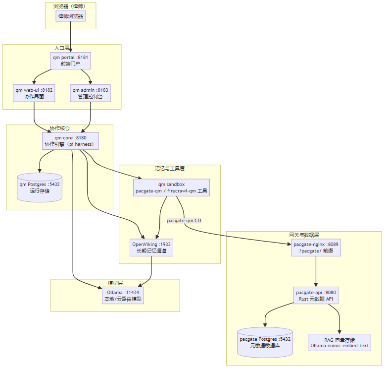

# qm + OpenViking + pacgate-ai 网关/RAG 集成手册

> 面向律师事务所技术团队与运维工程师
> 版本 0.1.0 — 2026-09-04
> 中文版（PDF） | 英文版：[qm-openviking-pacgate-handbook.md](qm-openviking-pacgate-handbook.md)

---

## 1. 手册说明

本手册面向需要部署、运维与理解 **qm（协作工作空间）+ OpenViking（长期记忆）+ pacgate-ai 网关/RAG（法律元数据与向量检索）** 的技术团队。

它回答三个问题：

1. **qm 如何与 pacgate-ai 网关/RAG 协同？** —— 架构与数据流
2. **每个组件做什么？** —— 功能与职责
3. **如何部署与排障？** —— 安装步骤与常见问题

> **红线**：本系统中的所有 AI 输出均为**律师复核前的草稿**，绝不构成最终法律意见，也绝不静默捏造事实。这一原则贯穿全部组件。

---

## 2. 系统架构

### 2.1 数据流



### 2.2 组件职责

| 组件 | 端口 | 职责 | 实现 |
|---|---|---|---|
| **qm portal** | 8181 | 前端门户：登录入口，代理到 web-ui/admin | `ghcr.io/yc-software/qm/portal` |
| **qm web-ui** | 8182 | 协作界面：会话、文件、审批 | `ghcr.io/yc-software/qm/web-ui` |
| **qm admin** | 8183 | 管理控制台：用户、资源、审计 | `ghcr.io/yc-software/qm/admin` |
| **qm core** | 8180 | 协作引擎：运行编排、pi harness、审批 | `ghcr.io/yc-software/qm/core` |
| **qm auth** | 内部 | 认证代理（Resend/SMTP 登录链接） | `ghcr.io/yc-software/qm/auth` |
| **OpenViking** | 1933 | 长期记忆：结构化记忆、语义检索 | `ghcr.io/volcengine/openviking` |
| **pacgate-api** | 8080 | 法律元数据：案件、文档、工作流、RAG | `ghcr.io/jzkk720/pacgate-api:0.1.3`（Rust） |
| **pacgate-nginx** | 8089 | 统一入口，`/pacgate/` 前缀 | `nginx:1.27-alpine` |
| **Ollama** | 11434 | 本地/云路由模型 + embedding | Windows 原生 |

---

## 3. qm：协作工作空间

### 3.1 它是什么

qm 是 Pacgate-ai 的**协作工作空间**。律师在浏览器中打开它，进行团队配合：共享文件、审批工作流、分派任务、跟踪审批。它通过 `qm up` 独立运行（无 Docker 镜像），使用 **pi harness** 编排 AI 运行。

### 3.2 关键技术点

- **无 Docker 镜像**：qm 通过 `deploy/qm-pacgate/` 目录里的 `qm up` 运行。
- **harness**：默认使用 **pi**（`HARNESS=pi`）。pi harness 是**进程内**运行（`src/harness/pi-harness.ts`），无需额外安装。
- **模型**：`PI_MODEL` 指定模型 ID。`glm-5.3-flash:cloud` 是自定义注册项，路由到 Ollama（`http://host.docker.internal:11434/v1`）。

### 3.3 模型配置（qm.config.jsonc）

```jsonc
"env": {
  "core": {
    "HARNESS": "pi",
    "SANDBOX_BACKEND": "local",
    "MODEL_BASE_URL": "http://host.docker.internal:11434/v1",
    "PI_MODEL": "glm-5.3-flash:cloud",
    "PI_DETECT_MODEL": "glm-5.3-flash:cloud",
    "PI_TITLE_MODEL": "glm-5.3-flash:cloud",
    "PI_JUDGE_MODEL": "glm-5.3-flash:cloud",
    "NODE_ENV": "development"
  }
}
```

> **为什么设置 PI_DETECT/TITLE/JUDGE_MODEL**：qm 的辅助模型调用（安全屏、标题、判断）默认解析到 `gpt-5.6-luna`（provider=openai），会打到真实 `api.openai.com` 并用假密钥 `ollama-local` 触发 401。设置这三个变量为 `glm-5.3-flash:cloud` 后，辅助调用路由到 Ollama。

### 3.4 沙箱与工具

qm 的沙箱层（`sandbox/`）暴露两个工具给 AI：

| 工具 | 说明 |
|---|---|
| **pacgate-qm** | Pacgate 工作流发现、案件绑定、案件记忆、工作流执行 |
| **firecrawl-qm** | 网页抓取与内容提取 |

`pacgate-qm` CLI 支持的命令：

```
workflow-categories  workflows  workflow  ensure-matter
memory-get  memory-save  execute-workflow
ov-remember  ov-search  ov-read
```

### 3.5 与 OpenViking 集成

qm 沙箱通过 `pacgate-qm` 的 `ov-remember`/`ov-search`/`ov-read` 命令访问 OpenViking 长期记忆：

- `ov-remember --content "<事实>"`：存储持久记忆（异步提取为结构化记忆）
- `ov-search --query "<语义查询>"`：回忆相关记忆、资源与技能
- `ov-read --uri "viking://user/default/memories/<path>"`：读取具体记忆文档

> **红线**：绝不通过 `ov-remember` 存储案件文件或保密案件材料——那些属于 Pacgate 案件存储。OpenViking 记忆仅用于会话上下文：决策、偏好与工作知识。

---

## 4. OpenViking：长期记忆通道

### 4.1 它是什么

OpenViking 是 Pacgate-ai 的**长期记忆**服务，把跨会话的决策、偏好与工作知识提取为结构化记忆，供 AI 在后续会话中语义检索、回忆与复用。

### 4.2 配置

```json
{
  "server": { "host": "0.0.0.0", "port": 1933, "root_api_key": "<OPENVIKING_ROOT_API_KEY>" },
  "storage": { "workspace": "/app/.openviking/workspace" },
  "embedding": {
    "dense": {
      "provider": "ollama",
      "api_base": "http://host.docker.internal:11434/v1",
      "model": "nomic-embed-text",
      "dimension": 768
    }
  }
}
```

### 4.3 关键点

- **端口**：`1933`（HTTP，对外暴露）
- **embedding**：Ollama 的 `nomic-embed-text`（768 维）
- **root_api_key**：⚠️ 使用 `OPENVIKING_ROOT_API_KEY`，**不是** `OPENVIKING_API_KEY`。

---

## 5. pacgate-ai 网关 / RAG（pacgate-api）

### 5.1 它是什么

pacgate-api 是 Pacgate-ai 的**法律元数据网关**（Rust 实现），管理租户、案件、文档、工作流模板，并提供 RAG（向量检索）与法律连接器检索。

### 5.2 服务表面

| 服务 | 端点 | 说明 |
|---|---|---|
| **认证** | `POST /api/auth/login` | 登录并返回 JWT |
| **案件** | `GET /api/matters` | 列出案件 |
| **文档** | `GET /api/matters/:id/documents` | 某案件的文档 |
| **工作流** | `GET /api/workflows` | 列出工作流模板 |
| 工作流分类 | `GET /api/workflow-categories` | 工作流分类 |
| 工作流详情 | `GET /api/workflows/:id` | 单工作流步骤 |
| **RAG** | `GET /api/kb/search` | 内部按案件向量检索 |
| **连接器** | `GET /api/search` | 外部法律数据库检索 |
| 连接器列表 | `GET /api/search/connectors` | 可用法律数据源 |

### 5.3 RAG（向量检索）

pacgate-api 的 RAG 存储使用 Ollama 的 `nomic-embed-text` 作为 embedding 模型，支持按案件（`matter_id`）的向量检索，并支持数据分级（`max_data_level`）。这使 AI 能够**带引用出处**地回答法律问题，而不必上传文件。

### 5.4 工作流模板

pacgate-api 暴露 **10 个法律工作流模板**：

| 分类 | 工作流 | 步骤数 |
|---|---|---|
| contract_review | Contract Review（合同审查） | 3 |
| contract_review | Contract Comparison（合同比对） | 2 |
| due_diligence | Due Diligence Review（尽调审查） | 3 |
| legal_research | Legal Research Memo（法律检索备忘录） | 3 |
| tabular_review | Tabular Document Review（表格化文档审查） | 3 |
| document_generation | Contract Drafting（合同起草） | 2 |
| document_generation | Legal Opinion（法律意见书） | 2 |
| compliance | Compliance Check（合规检查） | 3 |
| ma | SPA Review（股权收购协议审查） | 3 |
| litigation | Discovery Review（证据开示审查） | 3 |

### 5.5 pacgate-qm 桥

qm 沙箱中的 `pacgate-qm` CLI 调用 pacgate-api（经 nginx `/pacgate/` 前缀）。它用 `PACGATE_API_EMAIL`/`PACGATE_API_PASSWORD` 认证，支持：

- **工作流发现**：`workflow-categories`、`workflows`、`workflow <id>`
- **案件绑定**：`ensure-matter --org-id <org> --channel-id <channel>`
- **案件记忆**：`memory-get`、`memory-save --memory-json '{"key":"value"}'`
- **工作流执行**：`execute-workflow --workflow-id <id> --org-id <org> --channel-id <channel>`

> **红线**：绝不捏造工作流 ID、案件 ID 或 Pacgate 作用域绑定。先查询，或提供真实的 QM 作用域标识符。

---

## 6. 部署

### 6.1 前置条件

- Docker Desktop（WSL2 后端）
- Ollama（Windows 原生）已拉取 `glm-5.3-flash:cloud`、`nomic-embed-text` 等模型
- Node.js 24+（供 qm 使用）
- `deploy/qm-pacgate/` 目录与 `qm.config.jsonc`

### 6.2 qm 部署

```powershell
cd deploy/qm-pacgate
npm ci                # 或 npm install
npm exec qm -- check  # 必须通过
npm exec qm -- sandbox build  # 必须成功构建沙箱镜像
npm exec qm -- up     # 启动（会重建所有服务容器）
```

> **⚠️ `qm up` 是破坏性的**：它会 `docker rm -f` 所有服务并重新运行，注入 `.env` 中的密钥。这会把两处**手工修复**还原：
> 1. `pi-models.ts` 的 `glm-5.3-flash:cloud` 条目（在容器可写层），需 `docker cp` 重新应用。
> 2. dev 模式认证（若设置了 `CORE_SIGNING_SECRET` 会强制 portal 模式，登录失效）。

### 6.3 验证

```powershell
# 所有服务运行
docker ps | Select-String 'qm-pacgate'

# 健康检查（核心）
docker logs qm-pacgate-core --since 5m | Select-String 'listening'

# pacgate-api 工作流（经 nginx）
$env:PACGATE_API_URL='http://localhost:8089/pacgate'
$env:PACGATE_API_EMAIL='qm-bridge@pacgate.local'
$env:PACGATE_API_PASSWORD='<password>'
python deploy/qm-pacgate/sandbox/tools/pacgate-qm/pacgate_qm.py workflow-categories
```

---

## 7. 排障（常见问题）

### 7.1 登录：portal 显示 "This deployment isn't set up yet"

**症状**：portal 显示"未设置"，无法进入管理控制台。
**根因**：core 的 `modelProviderConfigured:false`；且 `admin_grants` 表为空，无人是 admin，`/admin` 403。
**修复**：向 `admin_grants` 表种入管理员：
```powershell
docker exec qm-pacgate-pg psql -U postgres -d qm -c "INSERT INTO admin_grants (principal_id, scope_id, role, granted_by, created_at) VALUES ('<email>','org:pacgate','org_admin','system', <epoch-ms>);"
```

### 7.2 登录：魔链 "This sign-in link no longer works"

**症状**：打开邮箱里的登录链接报"链接失效"。
**根因**：魔链是**单次使用且绑定浏览器**——JWT `st` 声明必须匹配发起流程的浏览器 OAuth `state` cookie。在另一个浏览器/配置文件打开或重复使用已用过的链接会报错。
**修复**：在发起登录的**同一个浏览器**中打开链接，点击确认。

### 7.3 模型 401 "Incorrect API key"

**症状**：`ollama-local` 被当作真实 API 密钥，请求打到真实 `api.openai.com`。
**根因**：辅助模型解析到 `gpt-5.6-luna`（provider=openai），或主模型选成 `gpt-5.6-sol`。
**修复**：
- 设置 `PI_DETECT_MODEL`/`PI_TITLE_MODEL`/`PI_JUDGE_MODEL` = `glm-5.3-flash:cloud`（辅助调用）
- 通过管理 API 将 org 基础模型设为 `glm-5.3-flash:cloud`：
```
PUT /admin/api/scopes/org:pacgate/base-model   body: {"modelId":"glm-5.3-flash:cloud"}
```

### 7.4 沙箱：报 "requires a running Docker daemon"

**症状**：`SANDBOX_BACKEND=local` 时报"需要运行中的 Docker daemon（是否在运行 Docker Desktop？）"，但 Docker 明明在运行。
**根因**：`SANDBOX_BACKEND=local` 让 qm core 在**容器内部**运行 `docker` CLI。但 qm 的 docker 后端**不挂载** `docker.sock`，且 core 镜像是 Alpine，**没有** docker 二进制。所以 preflight 必然失败（错误信息具有误导性）。
**修复**：需要给 core 挂载 `docker.sock` 并安装 docker CLI，或切换后端（`sprites`/`aws`）。目前未接线。

### 7.5 沙箱镜像不存在

**症状**：`local sandbox image ... not found`。
**根因**：配置中固定的镜像 `localhost:5000/pacgate-sandboxes@sha256:...` 本地不存在，`localhost:5000` registry 不可达。
**修复**：`npm exec qm -- sandbox build`（构建 `pacgate-sandbox:local`），或修正配置中的镜像 pin。

---

## 8. 安全与隐私

- **数据边界**：案件文件、检索历史保存在本机 AI 计算机上；对话文本经由已启用的 AI 模型服务处理，文件本身**绝不**上传。
- **凭据**：`PACGATE_API_EMAIL`/`PACGATE_API_PASSWORD`、`OPENVIKING_ROOT_API_KEY` 等存于 `.env`（gitignored）。**不要**提交到仓库。
- **红线**：AI 输出均为律师复核前的草稿，绝不构成最终法律意见。

---

> 本手册由 pacgate-ai 部署文档与运行环境自动整理生成。版本 0.1.0 — 2026-09-04。
