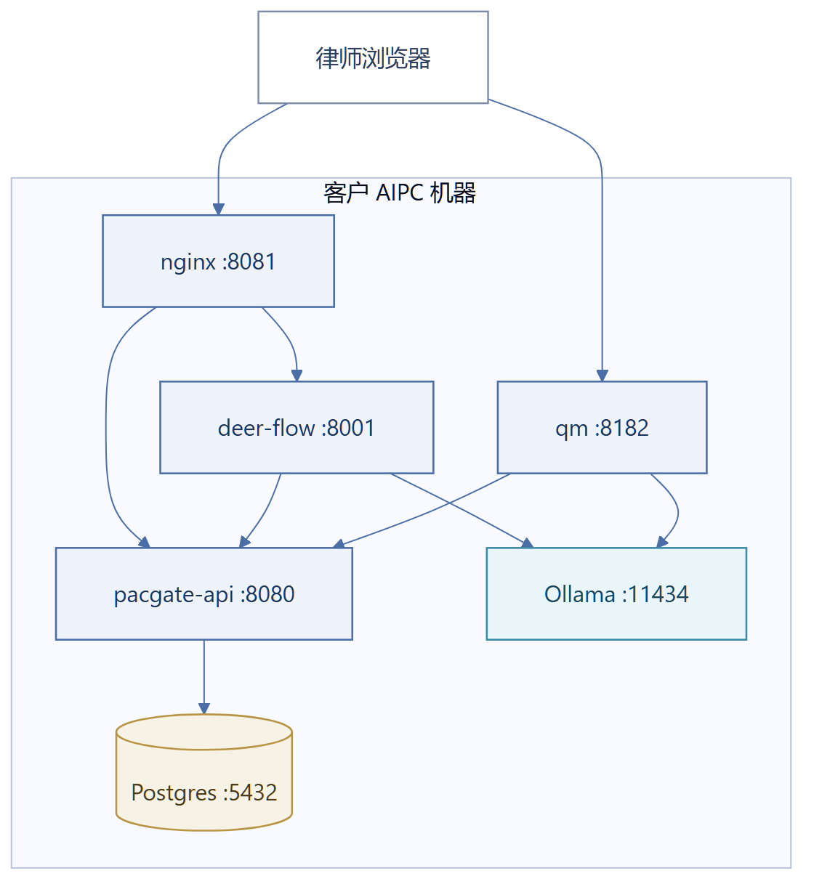
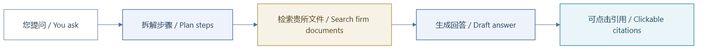
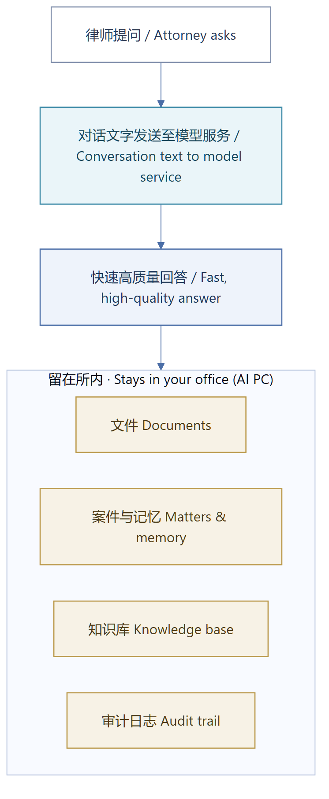

# Pacgate-ai 用户使用手册

> 面向律师事务所的律师、律师助理与合伙人
> 0.3.0 版 — 2026年10月5日（对应 Pacgate-ai 发布版 v0.1.23）
> English: [USER-MANUAL.md](USER-MANUAL.md) | PDF: [中文](USER-MANUAL-ZH.pdf) / [EN](USER-MANUAL.pdf)

## Pacgate-ai 是什么

Pacgate-ai 是贵所的私有法律 AI 助手。它运行在办公室内的 AI 计算机上——您的文件、案件资料与检索历史都保存在那台机器上，贵所不在任何云存储服务上开设账号。当您向助手提问时，对话文字会经由贵所启用的 AI 模型服务处理（以获得更快的速度与更高的质量）；您的文件本身绝不会被上传。确切的边界见下文"隐私与安全"一节。

Pacgate-ai 有**两种工作模式**，分别对应不同类型的任务：

| 模式 | 用途 | 适用场景 |
|---|---|---|
| **检索（Research）** | 带引用出处的深度法律检索、文件分析、合同审查 | "检索某一法域关于 X 问题的最新判例" |
| **协作（Collaborate）** | 共享文件、审批工作流、向团队分派任务 | "把这份合同草案分享给并购团队审阅" |

两种模式通过浏览器中的不同入口切换。它们运行在同一台 AI 计算机上，看到的案件与文件也完全相同。



---

## 开始使用

### 如何访问

1. 打开网页浏览器（Chrome、Edge 或 Firefox）。
2. 访问：**http://<您的AI计算机IP>:8089**
   - AI 计算机的 IP 地址请向 IT 人员询问
   - 如果您就坐在 AI 计算机前操作，请使用 **http://localhost:8089**
3. 您将看到 Pacgate-ai 首页，提供两个入口：
   - **"检索案件"** → 打开检索工作区
   - **"协作案件"** → 打开协作工作区

### 登录

两个工作区的登录方式不同。两者都使用真实身份登录——您的每一步操作都会以本人身份记入审计跟踪。

**检索工作区（deer-flow）— 用户名与密码：**

1. 在首页点击 **"检索案件"**。
2. 若尚未登录，系统会显示登录页。
3. 输入 IT 管理员提供的用户名（通常为您的邮箱）与密码。
4. 会话将持续有效，直到您主动登出或关闭浏览器。

检索工作区**不支持自助注册**：账号由管理员逐一创建。若您还没有账号，请向 IT 管理员申请开通（只需提供姓名与所内邮箱）。

**协作工作区（qm）— 邮件登录链接，无需密码：**

1. 在首页点击 **"协作案件"**。
2. 在登录页输入您的所内邮箱。
3. 系统会向该邮箱发送一条**一次性登录链接**（有效期很短，仅可使用一次）。
4. 从邮箱打开该链接即完成登录并进入工作区。无需记忆或重置密码。

只有管理员名单内的邮箱才能收到登录链接。若提示"该邮箱无法登录"，说明您尚未列入名单——请联系管理员加入。

两个工作区的界面上都会显示您的身份（侧栏/账号卡片中的您的邮箱）。共用一台机器时，请记得在那里登出。

---

## 模式一：检索（deer-flow）

### 此模式能做什么

检索工作区适用于需要深度分析的任务：

- **法律检索**："检索中国内地法院关于不可抗力条款的最新判例，并附引用出处"
- **合同审查**："分析这份合同中的不利条款与风险点"
- **文件比对**："比对这两版合同并标出差异"
- **表格提取**："从这 10 份合同中提取全部付款条款并制成表格"
- **报告生成**："检索跨境并购先例并生成一份带引用的备忘录"

### 使用方法

1. 点击首页的 **"检索案件"**
2. 选择您正在办理的**案件**（下拉列表展示贵所在办案件）
3. 在对话框中输入您的检索问题或任务
4. 按回车键或点击发送
5. AI 将：
   - 把您的请求拆解为多个步骤
   - 检索贵所的知识库与文件
   - 通读并分析相关文件
   - 输出带**引用出处**的结构化回答
6. 回答显示在对话中，右侧面板展示**成果文件**（AI 生成的文件）

### 读懂回答



- **行内引用**形如 `[1]`、`[2]`——点击即可跳转到源文件的具体页码
- **成果文件**（AI 生成的文件）显示在右侧面板——点击可预览、下载或打开
- **工具调用**会展示 AI 的逐步操作（读取文件、检索知识库、生成 DOCX 等）

### 文件操作

**上传源文件：**
- 将文件拖入对话框，或点击附件按钮
- 支持格式：`.docx`、`.pdf`、`.txt`、`.md`
- 文件将存储在您所选案件的目录下

**生成新文件：**
- 提问："请根据上述检索结果，为案件 M-001 生成一份合同审查备忘录"
- AI 通过文档引擎生成 `.docx` 文件（Office 文档经由 OfficeCLI 生成；Word/Excel/PowerPoint 均支持）
- 文件出现在成果面板中——点击即可下载或预览

**格式转换：**
- "把这份文件转换成 Markdown"——AI 可将 `.docx` / `.pdf` / `.pptx` / `.xlsx` / `.html` 转换为可引用、可编辑的 Markdown 文本
- 反向转换同样可用：提出请求即可将 Markdown 转为 `.docx` 或 `.pdf` 用于交付
- 转换在本机完成，文件内容不会在转换过程中离开 AI 计算机

**读取扫描文件的文字（OCR 提取）：**
- 上传扫描版 PDF 或文件照片，然后提问："读取这份文件的文字"
- OCR 引擎会通读各页，记录每段文字的所在页与坐标位置，并报告此次读取的完整程度
- 若某一页无法解析，助手会明确说明（"提取不完整"）——部分读取的结果绝不会被当作完整结果呈现
- 提取结果按文件版本保存，同一份文件不会被重复读取
- 批量读取："对本案件的全部文件做 OCR"——助手按每次运行的页数上限推进，并报告剩余额度

**文件的脱敏处理（为客户材料进入外部处理做准备）：**

系统可以将文件中的客户身份信息替换后，再交付给外部模型服务处理：

1. 提问："对这份文件做脱敏"——脱敏代理会执行替换管线
2. 系统将身份证号、电话号码、姓名等识别符替换为占位符，同时在密封的对照表中记录替换内容，并如实报告结果：判定结论、替换了多少处
3. 脱敏后的文本才可在对话中引用或送交外部处理；原始文本留存于本机
4. 对照表本身不会在对话中显示；只有管理员可以从表恢复原文，且每次恢复都有审计记录
5. 未通过检查的文件会被标记为拦截，无法离开本机

**您的文件存放在哪里（案件工作区）：**

每一份文件——上传的、生成的、AI 展示给您的——都归档在其所属案件之下：

```
您的案件
├── 文件（各自带版本号与脱敏状态）
├── 提取记录（OCR 读出了什么）
├── 对话中展示的成果（自动归档，文件名与您看到的成品一致）
└── 检索索引（助手可以引用哪些文件）
```

查看方法：向助手提问 **"显示本案件的案件工作区。"** 取回方法：按名称要求文件（"下载我们起草的备忘录"）、在成果面板中预览、或在界面上浏览案件文件列表。携带客户身份的文件在安全审查通过前暂不开放下载——新上传的文件在审查前显示"待处理"属于正常状态。

**版本历史：**
- 每份文件都有版本记录（v1、v2、v3……）
- 每次编辑或生成都会产生新版本
- 您可以查看并下载任意历史版本

### 可用的检索技能

检索工作区内置多项专业法律技能：

| 技能 | 功能 |
|---|---|
| 深度检索 | 多步骤检索，含源料收集与交叉核对 |
| 系统性文献综述 | 对法律文献与先例进行结构化综述 |
| 论文评析 | 分析与总结法律学术论文 |
| 咨询分析 | 商业/法律咨询分析框架 |
| 代码库深度检索 | 分析代码库或技术仓库 |

AI 会根据您的请求自动选择合适的技能，无需手动指定。

---

## 模式二：协作（qm）

### 此模式能做什么

协作工作区用于团队配合：

- **共享文件**："把这份合同草案分享给并购团队"
- **审批工作流**：在流程执行前审阅并批准文件生成工作流
- **分派任务**："把这份检索备忘录发送给案件 M-001 的全体合伙人"
- **跟踪审批**：查看待您审批与已审批的事项

### 使用方法

1. 点击首页的 **"协作案件"**
2. 您将看到贵所的协作面板
3. 左侧栏显示您的**会话**——每个会话对应某一案件或某一主题的讨论
4. 中间是对话区——输入消息或附上文件
5. 右侧面板显示该会话中共享的**文件**

### 共享文件

1. 在协作会话中点击文件/附件按钮
2. 从案件中选择文件（或上传新文件）
3. 选择共享对象：
   - **指定人员**（从贵所律师中选择）
   - **案件团队**（该案件全体成员）
   - **业务部门**（例如"全体并购律师"）
4. 选择权限：**仅可查看** 或 **可编辑**
5. 点击分享

被共享的同事在该案件的下次协作会话中即可看到这份文件。

### 审批工作流

当 AI 提议执行需要审批的操作时（例如"我将生成合同审查报告并分享给团队"）：

1. 对话中会出现一张**审批卡片**
2. 审阅 AI 想要执行的内容
3. 点击 **批准** 让其继续，或 **拒绝** 并附意见
4. AI 只在获得批准后才会执行

### 信息隔离墙

贵所管理员可对特定案件设置**信息隔离墙**。若案件设有隔离墙：

- 只有被指派的律师才能看到该案件的文件
- AI 在处理其他案件时不会引用隔离案件的文件
- 以此防范利益冲突风险

如果您尝试访问未被指派的案件，系统会提示"未找到案件"——这是有意设计，不是故障。

---

## 案件与文件

### 什么是案件

**案件**指一个法律事务、项目或委托。每份文件、每项检索任务、每次协作会话都从属于某个案件。案件从属于贵所（租户）。

贵所的案件可能包括：
- M-001：Smith 诉 Jones 诉讼案
- M-002：Acme 公司并购交易
- M-003：专利申请 #2026-XXX

### 文件结构

每个案件包含：
```
M-001（案件）
├── 文件（带版本的 .docx、.pdf、.txt）
├── 上传（您附加的源文件）
├── 记忆（AI 从您的工作中提取的事实）
└── 运行历史（AI 做过什么、何时做的）
```

### 文件版本

每份文件都有版本：
- AI 生成文件时创建 v1
- 您或 AI 编辑时创建 v2、v3 等
- 您可以下载或预览任意版本
- 当前版本始终是最新版

### 案件工作区（一个视图看全所有）

案件持有的全部内容集中在同一个视图中：

- **文件**——每份上传或生成的文件，带脱敏状态（待处理 / 已脱敏 / 已拦截）与当前版本
- **提取记录**——AI 从每份文件中读出了什么（页数、是否有解析失败的页面），让您随时知道机器视角的完整程度
- **知识库状态**——哪些文件已被索引供检索，是否已通过安全管线

在检索工作区直接问助手：**"显示本案件的案件工作区。"** 助手会先读取汇总视图并报告该案件现有的内容再开始工作——接手他人正在办理的案件时尤其有用。

### 展示给您的成果文件会被自动归档

当 AI 生成文件并在成果面板中展示时，系统会自动在案件下留存一份副本，文件名与您看到的成品一致（例如 `presented-report.docx`）。这意味着：

- 展示给您的成果文件从案件中随时可取，而不只存在于生成它的那次对话里
- 同一案件的其他成员也能找到它，不会锁在某一个人的会话中
- 更新或重启都不会丢失

若您希望以自己的命名保存同一文件，请要求助手直接上传为指定名称的文件——两种途径都可用。

### 引用出处

当 AI 在回答中引用来源时：
- `[1]` 表示它引用了某一文件的某一页
- 点击引用即可打开源文件并定位到相应页码
- 引用旁会显示原文摘录（不超过 25 词）

这对法律工作至关重要——AI 的每一句论断都应可追溯到源文件。

---

## 角色人格

Pacgate-ai 内置法律**角色人格**——针对不同业务领域调校的专业 AI 助手：

| 人格 | 业务领域 |
|---|---|
| 并购合伙人 | 并购交易 |
| 诉讼律师 | 诉讼程序、证据开示 |
| IP 法律顾问 | 知识产权 |
| 合规官 | 监管合规 |
| 跨境顾问 | 国际/跨境事务 |
| …… | 共 20 个，可按贵所需求定制 |

贵所可以定制人格或新增人格。如需尚不存在的人格，请联系管理员。

---

## 三层模型体系

Pacgate-ai 按任务使用三个模型层级：

| 层级 | 用途 | 速度 |
|---|---|---|
| **Main（主）** | 深度分析、合同审查、复杂推理 | 较慢，能力最强 |
| **Mid（中）** | 表格化审查、批量提取、结构化输出 | 中等 |
| **Low（轻）** | 标题、简短摘要、快速标签 | 最快 |

您无需选择层级——AI 会为每个子任务自动匹配合适的模型。快速标签用 Low，合同审查用 Main。

贵所管理员负责配置各层级所使用的模型，且模型组合会随更优模型的出现而更新。检索与协作对话可能使用托管模型以保证速度；繁重的文件处理在办公室的 AI 计算机上完成。

---

## 隐私与安全



### 留在您机器上的内容

- **全部文件**——上传的、生成的、编辑的
- **全部案件数据**——案卷、检索历史、记忆
- **知识库与检索索引**
- **全部协作**——仅在贵所内网范围内共享

### 发送至 AI 模型服务的内容

- **对话文字**——您的问题以及助手为回答而读取的特定段落，将由贵所启用的模型服务处理，以获得更快、更高质量的回答。
- 您的文件本身绝不会上传至该服务，任何案件数据也不会存储在云端账号中。

如某位客户的案件要求完全禁止任何对外处理，请在就该案件使用本系统之前告知贵所管理员。

### 谁能看到什么

- 您只能看到分配给自己的案件
- 文件以其所属案件为边界
- 信息隔离墙防止跨案件数据泄露
- 每次文件访问与 AI 操作均有日志记录（审计跟踪）

---

## 常见问题

### "AI 太慢了"

深度检索任务（Main 层级）耗时较长，因为它要执行多个步骤：检索、通读、分析、交叉核对、生成。一份完整研究报告可能需要 2-5 分钟。快速任务（摘要、标签）只需几秒。这是正常现象——质量需要时间。

### "我看不到本应有权限的案件"

请联系贵所管理员。案件分配与信息隔离墙由管理员控制。未被指派的案件不会出现在您的列表中。

### "AI 引用错了"

点击引用打开源文件。如引用确实有误，请在对话中告知 AI："该引用有误，正确页码是 15 而不是 12。" AI 会自行更正，并更新记忆以避免未来再犯。

### "我可以编辑 AI 生成的文件吗？"

可以。下载 `.docx` 成果文件，在 Word 中编辑后重新上传，即成为新版本（v2、v3……）。您也可以直接要求 AI 修改文件。

### "如何把我的检索成果分享给同事？"

1. 在检索工作区中，AI 会生成成果文件（例如检索备忘录 `.docx`）
2. 切换到协作工作区
3. 在同一案件下开启会话
4. 将该文件分享给同事

### "AI 计算机宕机了怎么办？"

您的数据是安全的——它们保存在 AI 计算机磁盘的 Docker 卷中。AI 计算机重启后，Docker Desktop 会自动启动容器（如已配置），您的全部案件、文件与历史都会完好保留。如需帮助，请联系 IT 管理员。

### "如何获得新版软件？"

有更新时管理员会通知您。管理员只需运行一条更新命令。更新绝不影响您的数据——变化的只是软件引擎。您的全部案件、文件与自定义配置都会保留。

---

## 键盘快捷键

| 快捷键 | 功能 |
|---|---|
| Enter | 发送消息 |
| Shift+Enter | 消息内换行 |
| Ctrl+K | 搜索案件/文件（如可用） |
| Esc | 关闭成果预览 |

---

## 获取帮助

- **技术问题**（无法登录、页面打不开）：联系贵所 IT 管理员
- **功能需求**（需要新人格、新工作流模板）：联系贵所的 Pacgate-ai 管理员
- **培训**（如何高效使用检索或协作）：请管理员安排与 Cubecloud 支持的交流场次

---

## 术语表

| 术语 | 含义 |
|---|---|
| **案件（Matter）** | 一个法律事务、项目或委托 |
| **租户（Tenant）** | 贵所（组织边界） |
| **成果（Artifact）** | AI 生成的文件（如 .docx 检索备忘录） |
| **引用（Citation）** | 指向特定文件特定页码的出处，显示为 [1]、[2] |
| **人格（Persona）** | 面向某业务领域的专业 AI 助手（如"并购合伙人"） |
| **信息隔离墙（Ethical wall）** | 限制特定律师查看某案件数据的机制 |
| **层级（Tier）** | 任务所用模型的能力级别（Main/Mid/Low） |
| **范围（Scope）** | 案件或业务部门的访问边界 |
| **Ollama** | AI 计算机上的本地模型运行器 |
